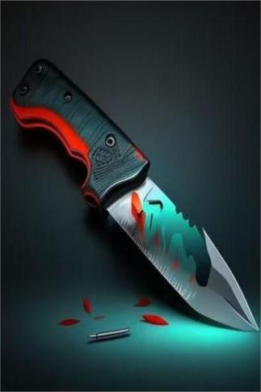

# 苏伯锋具(天启)  
> 苏伯锋具，锋而有韧。  
  
<table class="table table-bordered" data-toggle="table"  data-show-header="false"><thead style="display:none"><tr ><th  style="width:50%;text-align:left;vertical-align:top;"  >title</th><th  style="width:50%;text-align:left;vertical-align:top;"  ></th></tr></thead><tr ><td  style="width:50%;text-align:left;vertical-align:top;"  >**重量：**100  **标签：**	[“刮具”](tag_Scraper.md), [“切割工具”](tag_Cutter.md), [“高级切割工具”](tag_CutterAdv.md), [“沉重的”](tag_Heavy.md), [“美丽的/好看的”](tag_Pretty.md)  **可用次数：**10</td><td  style="width:50%;text-align:left;vertical-align:top;"  >

<a href="tq_Nc_DiasterBeason_Character_Lola_StartMaterials_ModernKnives.md" style="color:black">苏伯锋具</a>

</td></tr></tbody></table>  
  
## 获取来源  

抢救物资

[漂流物资(深海)](tq_Nc_DeepSea_ScatteredMaterials.md)

  
  
## 属性   

<table style="margin-bottom:0px;"><tr><td style="width:30%;text-align:left; background-color:#FEFEFE;font-size:1.3em;font-weight:bold;">使用次数</td><td style="font-size:1em;background-color:#FEFEFE">初始：10 -</td></tr><tr style="background-color:#FFFFFF"><td colspan=2>** 到达0时： ** 自身: →消失</td></tr></table>
  

