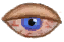
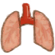
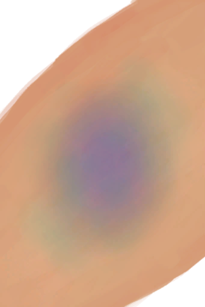
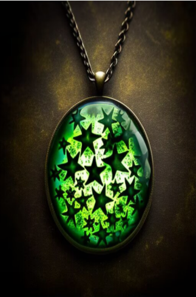

# 自然之灵(天启)  
> 万物生机在其中缓缓流淌...  
  
<table class="table table-bordered" data-toggle="table"  data-show-header="false"><thead style="display:none"><tr ><th  style="width:50%;text-align:left;vertical-align:top;"  >title</th><th  style="width:50%;text-align:left;vertical-align:top;"  ></th></tr></thead><tr ><td  style="width:50%;text-align:left;vertical-align:top;"  >**环境：**[幽灵船(环境)](tq_Env_GhostShip.md)  **装备：**  ** 效果: ** [

[烧伤](Burns.md)](Burns.md)加成<b>-0.5</b> [

[眼部损伤](EyeDamage.md)](EyeDamage.md)加成<b>-0.5</b> [

[肺部伤害](LungDamage.md)](LungDamage.md)加成<b>-0.5</b> [

[淤青](Bruising.md)](Bruising.md)加成<b>-0.5</b> [

[局部烧伤](tq_Gs_DisasterBeason_Burns.md)](tq_Gs_DisasterBeason_Burns.md)加成<b>-0.5</b> [

[肺部损伤](tq_Gs_DisasterBeason_LungDamage.md)](tq_Gs_DisasterBeason_LungDamage.md)加成<b>-0.5</b></td><td  style="width:50%;text-align:left;vertical-align:top;"  >

<a href="tq_Nc_FlowerSea_CureWoundBall.md" style="color:black">自然之灵</a>

</td></tr></tbody></table>  
  
## 获取来源  

这是..

[梦境(事件)](tq_Event_FlowerSea_TwistedVine_Boss_Death_Gril_Leave_Flower.md)

探索

[骷髅船(幽灵船)](tq_Exp_GhostShip.json.md)

  
  
## 其他效果  
<table class="table table-bordered" data-toggle="table"  ><thead style=""><tr ><th  style="text-align:left;vertical-align:top;"  >名称</th><th  style="text-align:left;vertical-align:top;"  data-sortable="true"  >条件</th><th  style="text-align:left;vertical-align:top;"  >变化</th><th  style="text-align:left;vertical-align:top;"  data-sortable="true"  >玩家状态</th></tr></thead><tr ><td  style="text-align:left;vertical-align:top;"  >自然之灵</td><td  style="text-align:left;vertical-align:top;"  ></td><td  style="text-align:left;vertical-align:top;"  >[“开放性伤口”](tag_OpenWound.md) [已缝合的左臂撕裂伤](W_ArmLacerationLStitched.md) [已缝合的右臂撕裂伤](W_ArmLacerationRStitched.md) [已缝合的左腿撕裂伤](W_LegLacerationLStitched.md) [已缝合的右腿撕裂伤](W_LegLacerationRStitched.md) [已缝合的轻微撕裂伤](W_MinorLacerationStitched.md) [左臂骨折](W_ArmFractureL.md) [右臂骨折](W_ArmFractureR.md) [左腿骨折](W_LegFractureL.md) [右腿骨折](W_LegFractureR.md) [海怪刺伤](W_SeahoundSting.md) [左臂撕裂伤](W_ArmLacerationL.md) [右臂撕裂伤](W_ArmLacerationR.md) [左腿撕裂伤](W_LegLacerationL.md) [右腿撕裂伤](W_LegLacerationR.md) [轻微撕裂伤](W_MinorLaceration.md) [鲨鱼咬伤](W_SharkBite.md)  </td><td  style="text-align:left;vertical-align:top;"  ></td></tr></tbody></table>  
  

