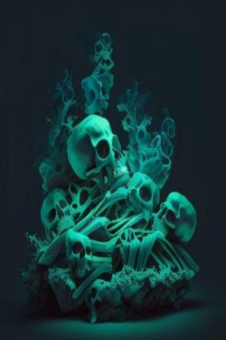

# 骨堆  
> 海藻、潮汐。这堆骨头在缓慢移动..  
  
<table class="table table-bordered" data-toggle="table"  data-show-header="false"><thead style="display:none"><tr ><th  style="width:50%;text-align:left;vertical-align:top;"  >title</th><th  style="width:50%;text-align:left;vertical-align:top;"  ></th></tr></thead><tr ><td  style="width:50%;text-align:left;vertical-align:top;"  >** 不可堆叠 **  **环境：**[幽灵船(环境)](tq_Env_GhostShip.md)  **重量：**1000000  **可用次数：**3</td><td  style="width:50%;text-align:left;vertical-align:top;"  >

<a href="tq_Nc_GhostShip_BonePile.md" style="color:black">骨堆</a>

</td></tr></tbody></table>  
  
## 获取来源  

Go for a Walk

[骷髅船(幽灵船)](tq_Exp_GhostShip.json.md)

转化

[船长(幽灵船)](tq_Nc_GhostShip_CaptainSkeleton.md)

  
  
## 动作  

<table><tr><td rowspan="2" style="width:200px;text-align:center;font-size:1.3em;font-weight:bold">

清理骨堆

30分

</td><td></td></tr><tr><td><b>自身：</b>使用次数  <b>-1</b></td></tr><tr><td colspan="2">[

[死灵骨](tq_Nc_GhostShip_DeathBones.md)](tq_Nc_GhostShip_DeathBones.md)(<b>+1</b>), [

[骷髅(幽灵船)](tq_Nc_GhostShip_BonePile_ProducedBoneMonster.md)](tq_Nc_GhostShip_BonePile_ProducedBoneMonster.md)(<b>+1</b>)</td></tr></table>
  
  
  
## 属性   

<table style="margin-bottom:0px;"><tr><td style="width:30%;text-align:left; background-color:#FEFEFE;font-size:1.3em;font-weight:bold;">使用次数</td><td style="font-size:1em;background-color:#FEFEFE">初始：3 -</td></tr><tr style="background-color:#FFFFFF"><td colspan=2>** 到达0时： ** 自身: →消失</td></tr></table>
  

<table style="margin-bottom:0px;"><tr><td style="width:30%;text-align:left; background-color:#FEFEFE;font-size:1.3em;font-weight:bold;">

</td><td style="font-size:1em;background-color:#FEFEFE">初始：2 , 最大：9 -</td></tr><tr style="background-color:#FFFFFF"><td colspan=2>** 到达0时： ** 自身: 

  <b>+9(100%)</b> [

[骷髅(幽灵船)](tq_Nc_GhostShip_BonePile_ProducedBoneMonster.md)](tq_Nc_GhostShip_BonePile_ProducedBoneMonster.md)(<b>+1</b>)</td></tr></table>
  

