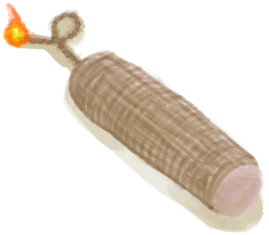

# 骷髅  
> 身败残躯，只剩骨架。打烂它的脑袋，它仍在颤抖..  
  
<table class="table table-bordered" data-toggle="table"  data-show-header="false"><thead style="display:none"><tr ><th  style="width:50%;text-align:left;vertical-align:top;"  >title</th><th  style="width:50%;text-align:left;vertical-align:top;"  ></th></tr></thead><tr ><td  style="width:50%;text-align:left;vertical-align:top;"  >** 不可堆叠 **  **环境：**[幽灵船(环境)](tq_Env_GhostShip.md)  **可用次数：**2</td><td  style="width:50%;text-align:left;vertical-align:top;"  >

<a href="tq_Nc_GhostShip_BonePile_ProducedBoneMonster.md" style="color:black">骷髅</a>

</td></tr></tbody></table>  
  
## 获取来源  

骨片横飞！

[巨响(事件)](tq_Event_GhostShip_BonePile_ProducedBoneMonster_ExplosivesBoom.md)

Go for a Walk

[骷髅船(幽灵船)](tq_Exp_GhostShip.json.md)

清理骨堆

[骨堆(幽灵船)](tq_Nc_GhostShip_BonePile.md)

转化

[骨堆(幽灵船)](tq_Nc_GhostShip_BonePile.md)

  
  
## 动作  

<table><tr><td rowspan="2" style="width:200px;text-align:center;font-size:1.3em;font-weight:bold">

进攻！

3分

</td><td></td></tr><tr><td><b>自身：</b>使用次数  <b>-1</b></td></tr><tr><td colspan="2">[

[对抗！(事件)](tq_Event_GhostShip_BonePile_ProducedBoneMonster_Confrontion.md)](tq_Event_GhostShip_BonePile_ProducedBoneMonster_Confrontion.md)(<b>+1</b>)</td></tr></table>
  
  
  
## 可拖入  

<table style="margin-bottom:0px;"><tr><td style="width:40%;text-align:left; background-color:#FEFEFE"><b>拖入：</b>[

[炸药(开)](DynamiteOn.md)](DynamiteOn.md)</td><td style="width:40%;font-size:1em;font-weight:bold;background-color:#FEFEFE">炸药投掷！  </td></tr><tr style="background-color:#FFFFFF"><td style=""><b>使用物：</b>→消失</td><td style=""><b>自身：</b></td></tr><tr><td colspan="2">[

[炸药](tq_Nc_GhostShip_BonePile_ProducedBoneMonster_Explosives.md)](tq_Nc_GhostShip_BonePile_ProducedBoneMonster_Explosives.md)(<b>+1</b>)</td></tr></table>
  
  
## 属性   

<table style="margin-bottom:0px;"><tr><td style="width:30%;text-align:left; background-color:#FEFEFE;font-size:1.3em;font-weight:bold;">使用次数</td><td style="font-size:1em;background-color:#FEFEFE">初始：2 -</td></tr><tr style="background-color:#FFFFFF"><td colspan=2>** 到达0时： ** 自身: →消失</td></tr></table>
  

<table style="margin-bottom:0px;"><tr><td style="width:30%;text-align:left; background-color:#FEFEFE;font-size:1.3em;font-weight:bold;">

</td><td style="font-size:1em;background-color:#FEFEFE">初始：1 , 最大：12 每15分钟-1 , 最多需要：3小时</td></tr><tr style="background-color:#FFFFFF"><td colspan=2>** 到达0时： ** [

[亡者呐喊(事件)](tq_Event_GhostShip_BonePile_ProducedBoneMonster_Attack.md)](tq_Event_GhostShip_BonePile_ProducedBoneMonster_Attack.md)(<b>+1</b>) 

: <b><b>12</b></b></td></tr></table>
  

<table style="margin-bottom:0px;"><tr><td style="width:30%;text-align:left; background-color:#FEFEFE;font-size:1.3em;font-weight:bold;">特殊2</td><td style="font-size:1em;background-color:#FEFEFE">初始：1 , 最大：1 -</td></tr><tr style="background-color:#FFFFFF"><td colspan=2>** 到达0时： ** 自身: →消失 [

[死灵骨](tq_Nc_GhostShip_DeathBones.md)](tq_Nc_GhostShip_DeathBones.md)(<b>+1</b>)</td></tr></table>
  

