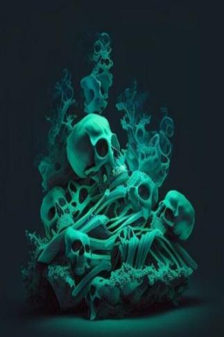
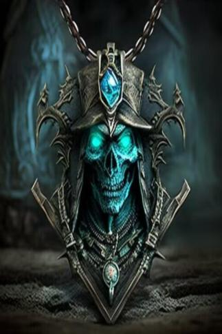

# 船长(天启)  
> 它站在船的最顶端..拿着锈蚀的长刀指向大海..  
  
<table class="table table-bordered" data-toggle="table"  data-show-header="false"><thead style="display:none"><tr ><th  style="width:50%;text-align:left;vertical-align:top;"  >title</th><th  style="width:50%;text-align:left;vertical-align:top;"  ></th></tr></thead><tr ><td  style="width:50%;text-align:left;vertical-align:top;"  >** 可重命名 **  ** 不可删除 **  ** 不可堆叠 **  **环境：**[幽灵船(环境)](tq_Env_GhostShip.md)  **标签：**	[“东”](tag_East.md)  **减重：**0  **可用次数：**2880</td><td  style="width:50%;text-align:left;vertical-align:top;"  >

<a href="tq_Nc_GhostShip_CaptainSkeleton.md" style="color:black">船长</a>

</td></tr></tbody></table>  
  
## 属性   

<table style="margin-bottom:0px;"><tr><td style="width:30%;text-align:left; background-color:#FEFEFE;font-size:1.3em;font-weight:bold;">

Hunger</td><td style="font-size:1em;background-color:#FEFEFE">初始：2880 , 最大：5760 每15分钟-1 , 最多需要：60天</td></tr><tr style="background-color:#FFFFFF"><td colspan=2>** 到达0时：Dead of Hunger ** 自身: →消失</td></tr></table>
  

<table style="margin-bottom:0px;"><tr><td style="width:30%;text-align:left; background-color:#FEFEFE;font-size:1.3em;font-weight:bold;">

Thirst</td><td style="font-size:1em;background-color:#FEFEFE">初始：2880 , 最大：5760 每15分钟-1 , 最多需要：60天</td></tr><tr style="background-color:#FFFFFF"><td colspan=2>** 到达0时：Dead of Thirst ** 自身: →消失</td></tr></table>
  

<table style="margin-bottom:0px;"><tr><td style="width:30%;text-align:left; background-color:#FEFEFE;font-size:1.3em;font-weight:bold;">

</td><td style="font-size:1em;background-color:#FEFEFE">初始：500 , 最大：1000 每15分钟-2 , 最多需要：5天5小时</td></tr><tr style="background-color:#FFFFFF"><td colspan=2>** 到达0时： ** 自身: 

  <b>+250～+500(25%～50%)</b> ** 到达上限时： ** 自身: 

  <b>-750(-75%)</b></td></tr></table>
  

<table style="margin-bottom:0px;"><tr><td style="width:30%;text-align:left; background-color:#FEFEFE;font-size:1.3em;font-weight:bold;">生命值</td><td style="font-size:1em;background-color:#FEFEFE">初始：1 , 最大：16 -</td></tr><tr style="background-color:#FFFFFF"><td colspan=2>** 到达0时： ** 自身: Hunger

  <b>+0(0%)</b> Thirst

  <b>+0(0%)</b> 生命值  <b>+16(100%)</b> [

[骨堆(幽灵船)](tq_Nc_GhostShip_BonePile.md)](tq_Nc_GhostShip_BonePile.md)(<b>+1</b>)</td></tr></table>
  

<table style="margin-bottom:0px;"><tr><td style="width:30%;text-align:left; background-color:#FEFEFE;font-size:1.3em;font-weight:bold;">

Health</td><td style="font-size:1em;background-color:#FEFEFE">初始：1000 , 最大：1000 每15分钟+0 , 最多需要：Infinity天</td></tr><tr style="background-color:#FFFFFF"><td colspan=2>** 到达0时： ** 自身: →消失 Health

  <b>+0(0%)</b> [

[骷髅项链](tq_Nc_GhostShip_CaptainSkeleton_Necklace.md)](tq_Nc_GhostShip_CaptainSkeleton_Necklace.md)(<b>+1</b>)</td></tr></table>
  

