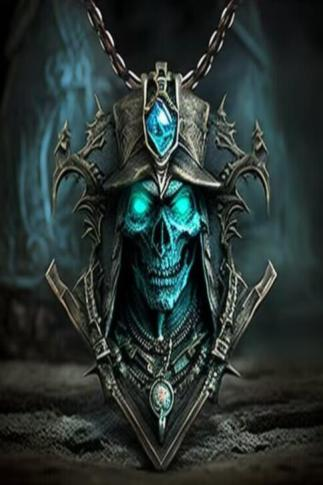

# 骷髅项链  
> 项链中间有一位美丽的身影..  
  
<table class="table table-bordered" data-toggle="table"  data-show-header="false"><thead style="display:none"><tr ><th  style="width:50%;text-align:left;vertical-align:top;"  >title</th><th  style="width:50%;text-align:left;vertical-align:top;"  ></th></tr></thead><tr ><td  style="width:50%;text-align:left;vertical-align:top;"  >**重量：**100  **装备时减重：**-100  **标签：**	[“头部（外层）”](tag_OuterHead.md), [“腿部（内层）”](tag_Clothing.md)  **装备：**[“颈部”](eTag_Neck.md)  ** 效果: ** [

[绝热](InsulationHeat.md)](InsulationHeat.md)<b>+2</b> [

[雨水防护](RainProtection.md)](RainProtection.md)<b>+0.5</b> [

[阳光防护](SunProtection.md)](SunProtection.md)<b>+1</b> [

[世界观](Structure.md)](Structure.md)加成<b>+0.2</b> [

[情绪](Morale.md)](Morale.md)加成<b>+0.5</b> [

[孤立感](Isolation.md)](Isolation.md)加成<b>-0.2</b></td><td  style="width:50%;text-align:left;vertical-align:top;"  >

<a href="tq_Nc_GhostShip_CaptainSkeleton_Necklace.md" style="color:black">骷髅项链</a>

</td></tr></tbody></table>  
  
## 获取来源  

转化

[船长(幽灵船)](tq_Nc_GhostShip_CaptainSkeleton.md)

  
  

