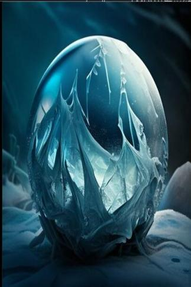

# 寒霜(天启)  
> 散发着寒冷的气息..  
  
<table class="table table-bordered" data-toggle="table"  data-show-header="false"><thead style="display:none"><tr ><th  style="width:50%;text-align:left;vertical-align:top;"  >title</th><th  style="width:50%;text-align:left;vertical-align:top;"  ></th></tr></thead><tr ><td  style="width:50%;text-align:left;vertical-align:top;"  >**装备：**  ** 效果: ** [

[体感温度](TemperaturePerceived.md)](TemperaturePerceived.md)<b>-20</b> [

[过热](Hyperthermia.md)](Hyperthermia.md)加成<b>-1</b> [

[光亮](Light.md)](Light.md)<b>+5</b></td><td  style="width:50%;text-align:left;vertical-align:top;"  >

<a href="tq_Nc_Hail_IceCrystalsBall.md" style="color:black">寒霜</a>

</td></tr></tbody></table>  
  
## 获取来源  

打开

[寒霜(关)](tq_Nc_Hail_IceCrystalsBall_Off.md)

  
  
## 动作  

<table><tr><td rowspan="2" style="width:200px;text-align:center;font-size:1.3em;font-weight:bold">

关闭

3分

</td><td></td></tr><tr><td><b>自身：</b>→ [

[寒霜(关)](tq_Nc_Hail_IceCrystalsBall_Off.md)](tq_Nc_Hail_IceCrystalsBall_Off.md)</td></tr></table>
  
  
  
## 属性   

<table style="margin-bottom:0px;"><tr><td style="width:30%;text-align:left; background-color:#FEFEFE;font-size:1.3em;font-weight:bold;">

</td><td style="font-size:1em;background-color:#FEFEFE">初始：960 , 最大：960 -</td></tr><tr style="background-color:#FFFFFF"><td colspan=2>** 到达0时： ** 自身: →消失</td></tr></table>
  

