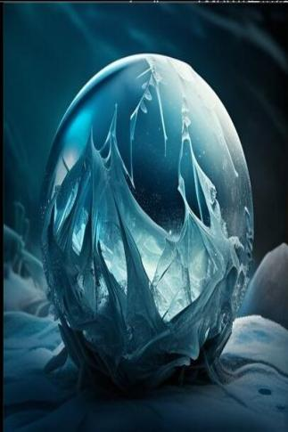

# 冰晶  
> 热源之下，纹丝未动。  
  
<table class="table table-bordered" data-toggle="table"  data-show-header="false"><thead style="display:none"><tr ><th  style="width:50%;text-align:left;vertical-align:top;"  >title</th><th  style="width:50%;text-align:left;vertical-align:top;"  ></th></tr></thead><tr ><td  style="width:50%;text-align:left;vertical-align:top;"  >**重量：**500  ** 效果: ** [

[体感温度](TemperaturePerceived.md)](TemperaturePerceived.md)<b>-0.5</b></td><td  style="width:50%;text-align:left;vertical-align:top;"  >

<a href="tq_Nc_Hail_IceCrystals_Ice.md" style="color:black">冰晶</a>

</td></tr></tbody></table>  
  
## 获取来源  

** 使用**[求生斧](AxeSurvival.md) , [石斧](StoneAxe.md) , [废金属斧](AxeScrap.md) , [燧石斧](AxeFlint.md) , [铜斧](AxeCopper.md) , [“斧”](tag_Axe.md)挖掘

[寒晶](tq_Nc_Hail_IceCrystals.md)

  
  
## 可用于蓝图  

<a href="tq_Bp_Hail_IceCoolBall.md" style="color:black">冰晶球</a>

<a href="tq_Bp_Hail_IceCrystalsBall.md" style="color:black">寒霜</a>

  
  
  
## 属性   

<table style="margin-bottom:0px;"><tr><td style="width:30%;text-align:left; background-color:#FEFEFE;font-size:1.3em;font-weight:bold;">耐久</td><td style="font-size:1em;background-color:#FEFEFE">初始：96 每15分钟-1 , 最多需要：1天</td></tr><tr style="background-color:#FFFFFF"><td colspan=2>** 到达0时： ** 自身: → [

[腐烂物](RottenRemains.md)](RottenRemains.md)</td></tr></table>
  

