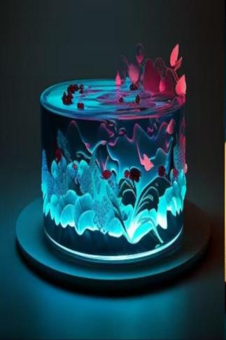

# 星星包(天启)  
> 星星般的包裹，有时里面会散发强烈的光芒。  
  
<table class="table table-bordered" data-toggle="table"  data-show-header="false"><thead style="display:none"><tr ><th  style="width:50%;text-align:left;vertical-align:top;"  >title</th><th  style="width:50%;text-align:left;vertical-align:top;"  ></th></tr></thead><tr ><td  style="width:50%;text-align:left;vertical-align:top;"  >**可用次数：**3840</td><td  style="width:50%;text-align:left;vertical-align:top;"  >

<a href="tq_Nc_Meteor_Imprint_StarDrop_StarFoodBag.md" style="color:black">星星包</a>

</td></tr></tbody></table>  
  
## 获取来源  

触摸光芒

[星辰消散(事件)](tq_Nc_Meteor_Imprint_Food_Food.md)

转化

[星星包](tq_Nc_Meteor_Imprint_StarDrop_StarFoodBag.md)

  
  
## 动作  

<table><tr><td rowspan="2" style="width:200px;text-align:center;font-size:1.3em;font-weight:bold">

打开包裹

3分

</td><td></td></tr><tr><td><b>自身：</b>

  <b>-1920(-50%)</b></td></tr><tr><td colspan="2"><b>需求：</b>

: <b>1920～3840(50%～100%)</b></td></tr><tr><td colspan="2">[

[星空蛋糕](tq_Nc_Meteor_Imprint_Food_TypeOne.md)](tq_Nc_Meteor_Imprint_Food_TypeOne.md)(<b>+1</b>), [

[星空蛋糕](tq_Nc_Meteor_Imprint_Food_TypeTwo.md)](tq_Nc_Meteor_Imprint_Food_TypeTwo.md)(<b>+1</b>), [

[星空蛋糕](tq_Nc_Meteor_Imprint_Food_TypeThree.md)](tq_Nc_Meteor_Imprint_Food_TypeThree.md)(<b>+1</b>), [

[星空蛋糕](tq_Nc_Meteor_Imprint_Food_TypeFour.md)](tq_Nc_Meteor_Imprint_Food_TypeFour.md)(<b>+1</b>), [

[星空蛋糕](tq_Nc_Meteor_Imprint_Food_TypeFive.md)](tq_Nc_Meteor_Imprint_Food_TypeFive.md)(<b>+1</b>)</td></tr></table>
  
  
  
## 可拖入  

<table style="margin-bottom:0px;"><tr><td style="width:40%;text-align:left; background-color:#FEFEFE"><b>拖入：</b>[

[星空元素](tq_Nc_Meteor_Imprint_StarElement.md)](tq_Nc_Meteor_Imprint_StarElement.md)</td><td style="width:40%;font-size:1em;font-weight:bold;background-color:#FEFEFE">投入其中  </td></tr><tr style="background-color:#FFFFFF"><td style=""><b>使用物：</b>→消失</td><td style=""><b>自身：</b>

  <b>+240(6.25%)</b>, Mango Growth

  <b>+0(0%)</b></td></tr></table>
  
  
## 属性   

<table style="margin-bottom:0px;"><tr><td style="width:30%;text-align:left; background-color:#FEFEFE;font-size:1.3em;font-weight:bold;">

</td><td style="font-size:1em;background-color:#FEFEFE">初始：3840 , 最大：3840 每15分钟+1 , 最多需要：40天</td></tr><tr style="background-color:#FFFFFF"><td colspan=2></td></tr></table>
  

<table style="margin-bottom:0px;"><tr><td style="width:30%;text-align:left; background-color:#FEFEFE;font-size:1.3em;font-weight:bold;">

Mango Growth</td><td style="font-size:1em;background-color:#FEFEFE">初始：0 , 最大：96 每15分钟+1 , 最多需要：1天</td></tr><tr style="background-color:#FFFFFF"><td colspan=2>** 到达上限时： ** 自身: → [

[星星包](tq_Nc_Meteor_Imprint_StarDrop_StarFoodBag.md)](tq_Nc_Meteor_Imprint_StarDrop_StarFoodBag.md)</td></tr></table>
  

