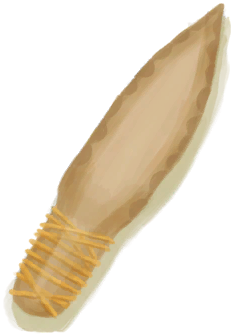
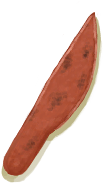
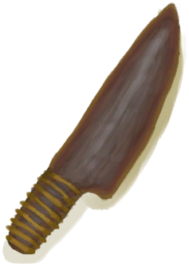
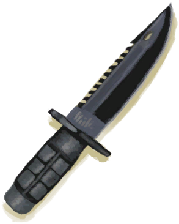
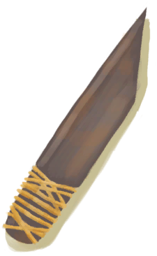

# 扭曲藤蔓  
> 层层环绕，扭曲盘缠。时不时可以看见其散发一些绿色的孢子。  
  
<table class="table table-bordered" data-toggle="table"  data-show-header="false"><thead style="display:none"><tr ><th  style="width:50%;text-align:left;vertical-align:top;"  >title</th><th  style="width:50%;text-align:left;vertical-align:top;"  ></th></tr></thead><tr ><td  style="width:50%;text-align:left;vertical-align:top;"  >**可用次数：**3</td><td  style="width:50%;text-align:left;vertical-align:top;"  >

<a href="tq_Nc_PollenSeason_Flower_TwistedVine.md" style="color:black">扭曲藤蔓</a>

</td></tr></tbody></table>  
  
## 获取来源  

** 使用**[求生斧](AxeSurvival.md) , [石斧](StoneAxe.md) , [废金属斧](AxeScrap.md) , [燧石斧](AxeFlint.md) , [铜斧](AxeCopper.md) , [骨刀](KnifeBone.md) , [铜刀](KnifeCopper.md) , [燧石刀](KnifeFlint.md) , [军刀](KnifeMilitary.md) , [黑曜石刀](KnifeObsidian.md) , [废金属刀](KnifeScrap.md) , [安全刀](SafetyKnife.md)清理藤蔓

[丛林之心(花海)](tq_Nc_FlowerSea_TwistedVine_Boss.md)

转化

[丛林之心(花海)](tq_Nc_FlowerSea_TwistedVine_Boss.md)

转化

[扭曲藤蔓](tq_Nc_PollenSeason_Flower_TwistedVine.md)

转化

[花粉季](tq_Wather_PollenSeason.md)

  
  
## 动作  

<table><tr><td rowspan="2" style="width:200px;text-align:center;font-size:1.3em;font-weight:bold">

点燃

15分

</td><td></td></tr><tr><td><b>自身：</b>→消失, 使用次数  <b>-1</b></td></tr><tr><td colspan="2"><b>需求：</b>使用次数: <b>0</b>, [

[光亮](Light.md)](Light.md): <b>10-100</b></td></tr><tr><td colspan="2">[

[剧烈燃烧(事件)](tq_Event_PollenSeason_TwistedVine_BurnDeath.md)](tq_Event_PollenSeason_TwistedVine_BurnDeath.md)(<b>+1</b>)</td></tr></table>
  
  
  
## 可拖入  

<table style="margin-bottom:0px;"><tr><td style="width:40%;text-align:left; background-color:#FEFEFE"><b>拖入：</b>[

[求生斧](AxeSurvival.md)](AxeSurvival.md) | [

[石斧](StoneAxe.md)](StoneAxe.md) | [

[废金属斧](AxeScrap.md)](AxeScrap.md) | [

[燧石斧](AxeFlint.md)](AxeFlint.md) | [

[铜斧](AxeCopper.md)](AxeCopper.md) | [

[骨刀](KnifeBone.md)](KnifeBone.md) | [

[铜刀](KnifeCopper.md)](KnifeCopper.md) | [

[燧石刀](KnifeFlint.md)](KnifeFlint.md) | [

[军刀](KnifeMilitary.md)](KnifeMilitary.md) | [

[黑曜石刀](KnifeObsidian.md)](KnifeObsidian.md) | [

[废金属刀](KnifeScrap.md)](KnifeScrap.md) | [

[安全刀](SafetyKnife.md)](SafetyKnife.md)</td><td style="width:40%;font-size:1em;font-weight:bold;background-color:#FEFEFE">清理藤蔓 (15分) </td></tr><tr style="background-color:#FFFFFF"><td style=""><b>使用物：</b>使用次数  <b>-1(-2%)</b></td><td style=""><b>自身：</b>使用次数  <b>-1</b></td></tr><tr><td colspan="2">

<table style="margin-bottom:3px;"><tr><td rowspan=2 style="text-align:center" width="80px">
基础权重

2
</td><td style="font-size:0.6em;line-height:0.6em;font-weight:bold">Dirt</td></tr><tr><td>[

[长木棍](StickLong.md)](StickLong.md)(<b>+1</b>)</td></tr></table>

<table style="margin-bottom:3px;"><tr><td rowspan=2 style="text-align:center" width="80px">
基础权重

1
</td><td style="font-size:0.6em;line-height:0.6em;font-weight:bold">Dirt</td></tr><tr><td>[

[长木棍](StickLong.md)](StickLong.md)(<b>+1</b>), [

[森林移动(事件)](tq_Event_PollenSeason_TwistedVineAttack.md)](tq_Event_PollenSeason_TwistedVineAttack.md)(<b>+1</b>)</td></tr></table>

</td></tr></table>
  
  
## 属性   

<table style="margin-bottom:0px;"><tr><td style="width:30%;text-align:left; background-color:#FEFEFE;font-size:1.3em;font-weight:bold;">使用次数</td><td style="font-size:1em;background-color:#FEFEFE">初始：3 -</td></tr><tr style="background-color:#FFFFFF"><td colspan=2>** 到达0时： ** 自身: →消失</td></tr></table>
  

<table style="margin-bottom:0px;"><tr><td style="width:30%;text-align:left; background-color:#FEFEFE;font-size:1.3em;font-weight:bold;">

芒果 成熟度</td><td style="font-size:1em;background-color:#FEFEFE">初始：0 , 最大：96 每15分钟+1 , 最多需要：1天</td></tr><tr style="background-color:#FFFFFF"><td colspan=2>** 到达上限时： ** 自身: → [

[扭曲藤蔓](tq_Nc_PollenSeason_Flower_TwistedVine.md)](tq_Nc_PollenSeason_Flower_TwistedVine.md)</td></tr></table>
  

<table style="margin-bottom:0px;"><tr><td style="width:30%;text-align:left; background-color:#FEFEFE;font-size:1.3em;font-weight:bold;">

</td><td style="font-size:1em;background-color:#FEFEFE">初始：1 , 最大：96 每15分钟-1 , 最多需要：1天</td></tr><tr style="background-color:#FFFFFF"><td colspan=2>** 到达0时： ** [

[森林移动(事件)](tq_Event_PollenSeason_TwistedVineAttack.md)](tq_Event_PollenSeason_TwistedVineAttack.md)(<b>+1</b>) 

: <b><b>192</b></b></td></tr></table>
  
## 其他效果  
<table class="table table-bordered" data-toggle="table"  ><thead style=""><tr ><th  style="text-align:left;vertical-align:top;"  data-sortable="true"  >名称</th><th  style="text-align:left;vertical-align:top;"  data-sortable="true"  >条件</th><th  style="text-align:left;vertical-align:top;"  >变化</th><th  style="text-align:left;vertical-align:top;"  data-sortable="true"  >玩家状态</th></tr></thead><tr ><td  style="text-align:left;vertical-align:top;"  ></td><td  style="text-align:left;vertical-align:top;"  ></td><td  style="text-align:left;vertical-align:top;"  >[丛林之心(花海)](tq_Nc_FlowerSea_TwistedVine_Boss.md) 

 +0.25</td><td  style="text-align:left;vertical-align:top;"  ></td></tr></tbody></table>  
  

