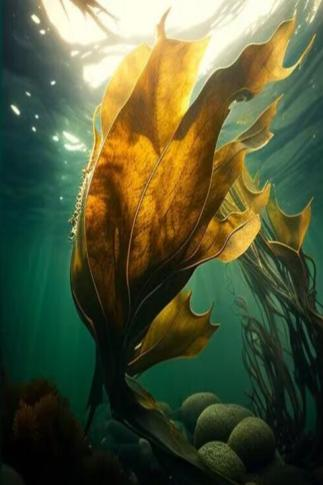

# 海带  
> 光滑柔顺，有时候会看见它微微颤动。  
  
<table class="table table-bordered" data-toggle="table"  data-show-header="false"><thead style="display:none"><tr ><th  style="width:50%;text-align:left;vertical-align:top;"  >title</th><th  style="width:50%;text-align:left;vertical-align:top;"  ></th></tr></thead><tr ><td  style="width:50%;text-align:left;vertical-align:top;"  >**重量：**50  **标签：**	[“可烹饪的”](tag_Cookable.md), [“喂食（草食动物）”](tag_FeedHerb.md), [“饲料”](tag_Feed.md)</td><td  style="width:50%;text-align:left;vertical-align:top;"  >

<a href="tq_Nc_UnderSea_Kelp_Food.md" style="color:black">海带</a>

</td></tr></tbody></table>  
  
## 获取来源  

Go for a Walk

[深海](tq_Exp_DeepSea.md)

Go for a Walk

[飓风海域](tq_Exp_OverTheDeepSea.md)

Go for a Walk

[浅海](tq_Exp_UnderSea.md)

采摘海带

[海带(浅海)](tq_Nc_UnderSea_Kelp.md)

采摘海带

[海带](tq_Nc_UnderSea_Kelp_Two.md)

  
  
## 动作  

<table><tr><td rowspan="2" style="width:200px;text-align:center;font-size:1.3em;font-weight:bold">

Eat

15分

</td><td>[“食用蔬菜类动作(组)”](VegetarianAction.md), [“进食动作(组)”](EatingAction.md)</td></tr><tr><td><b>自身：</b>→消失</td></tr><tr><td colspan="2"><b>状态变化：</b>[

[饱食](Satiation.md)](Satiation.md)<b>+15</b>, [

[胃](Stomach.md)](Stomach.md)<b>+2</b>, [

[水分](Hydration.md)](Hydration.md)<b>+5</b></td></tr></table>
  
  
  
## 可用于蓝图  

<a href="tq_Bp_UnderSea_Kelp_Plasters.md" style="color:black">润肤膏</a>

<a href="tq_Bp_UnderSea_MarineOintment.md" style="color:black">海洋药膏</a>

  
  
  
## 属性   

<table style="margin-bottom:0px;"><tr><td style="width:30%;text-align:left; background-color:#FEFEFE;font-size:1.3em;font-weight:bold;">耐久</td><td style="font-size:1em;background-color:#FEFEFE">初始：192 每15分钟-1 , 最多需要：2天</td></tr><tr style="background-color:#FFFFFF"><td colspan=2>** 到达0时： ** 自身: → [

[腐烂物](RottenRemains.md)](RottenRemains.md)</td></tr></table>
  

