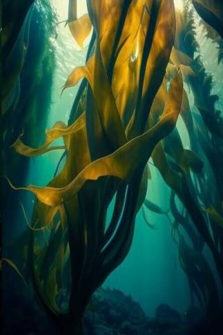

# 海带  
> 随着海流飘荡，扎根于深层的海底。  
  
<table class="table table-bordered" data-toggle="table"  data-show-header="false"><thead style="display:none"><tr ><th  style="width:50%;text-align:left;vertical-align:top;"  >title</th><th  style="width:50%;text-align:left;vertical-align:top;"  ></th></tr></thead><tr ><td  style="width:50%;text-align:left;vertical-align:top;"  >**重量：**10000</td><td  style="width:50%;text-align:left;vertical-align:top;"  >

<a href="tq_Nc_UnderSea_Kelp_Two.md" style="color:black">海带</a>

</td></tr></tbody></table>  
  
## 获取来源  

探索

[浅海](tq_Exp_UnderSea.md)

  
  
## 动作  

<table><tr><td rowspan="2" style="width:200px;text-align:center;font-size:1.3em;font-weight:bold">

采摘海带

15分

</td><td></td></tr><tr><td><b>自身：</b>

  <b>-96(-10%)</b></td></tr><tr><td colspan="2"><b>需求：</b>

: <b>96～960(10%～100%)</b></td></tr><tr><td colspan="2">

<table style="margin-bottom:3px;"><tr><td rowspan=2 style="text-align:center" width="80px">
基础权重

85
</td><td style="font-size:0.6em;line-height:0.6em;font-weight:bold">Dirt</td></tr><tr><td>[

[海带](tq_Nc_UnderSea_Kelp_Food.md)](tq_Nc_UnderSea_Kelp_Food.md)(<b>+1</b>)</td></tr></table>

<table style="margin-bottom:3px;"><tr><td rowspan=2 style="text-align:center" width="80px">
基础权重

15
</td><td style="font-size:0.6em;line-height:0.6em;font-weight:bold">Dirt</td></tr><tr><td>[

[海带(事件)](tq_Event_UnderSea_Kelp_Winding.md)](tq_Event_UnderSea_Kelp_Winding.md)(<b>+1</b>)</td></tr></table>

</td></tr></table>
  
  
  
## 属性   

<table style="margin-bottom:0px;"><tr><td style="width:30%;text-align:left; background-color:#FEFEFE;font-size:1.3em;font-weight:bold;">

</td><td style="font-size:1em;background-color:#FEFEFE">初始：960 , 最大：960 每15分钟+1 , 最多需要：10天</td></tr><tr style="background-color:#FFFFFF"><td colspan=2></td></tr></table>
  

