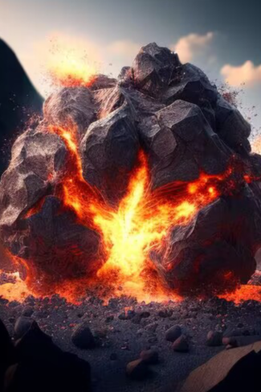
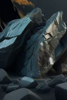

# 巨岩  
> 从火山中喷法出来的巨石，还带有岩浆的纹路，看起来很烫。  
  
<table class="table table-bordered" data-toggle="table"  data-show-header="false"><thead style="display:none"><tr ><th  style="width:50%;text-align:left;vertical-align:top;"  >title</th><th  style="width:50%;text-align:left;vertical-align:top;"  ></th></tr></thead><tr ><td  style="width:50%;text-align:left;vertical-align:top;"  >**重量：**1000  ** 效果: ** [

[体感温度](TemperaturePerceived.md)](TemperaturePerceived.md)<b>+5</b> [

[光亮](Light.md)](Light.md)<b>+5</b></td><td  style="width:50%;text-align:left;vertical-align:top;"  >

<a href="tq_Nc_VolcanicEruption_Drop_Rock_Hot.md" style="color:black">巨岩</a>

</td></tr></tbody></table>  
  
## 获取来源  

快闪开！

[轰隆隆！(事件)](tq_Event_VolcanicEruptions_RockDrop.md)

真男人直面冲击！

[轰隆隆！(事件)](tq_Event_VolcanicEruptions_RockDrop.md)

  
  
## 属性   

<table style="margin-bottom:0px;"><tr><td style="width:30%;text-align:left; background-color:#FEFEFE;font-size:1.3em;font-weight:bold;">耐久</td><td style="font-size:1em;background-color:#FEFEFE">初始：96 每15分钟-1 , 最多需要：1天</td></tr><tr style="background-color:#FFFFFF"><td colspan=2>** 到达0时：冷却 ** 自身: → [

[巨岩](tq_Nc_VolcanicEruption_Drop_Rock_Cold.md)](tq_Nc_VolcanicEruption_Drop_Rock_Cold.md)</td></tr></table>
  

