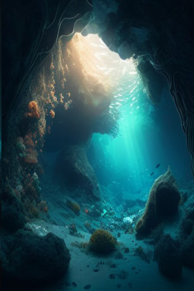

# 浅海  
> 波光磷磷，海月闪耀。  
  
<table class="table table-bordered" data-toggle="table"  data-show-header="false"><thead style="display:none"><tr ><th  style="width:50%;text-align:left;vertical-align:top;"  >title</th><th  style="width:50%;text-align:left;vertical-align:top;"  ></th></tr></thead><tr ><td  style="width:50%;text-align:left;vertical-align:top;"  >** 区域唯一 **</td><td  style="width:50%;text-align:left;vertical-align:top;"  >

<a href="tq_Path_BayToUnderSea.md" style="color:black">浅海</a>

</td></tr></tbody></table>  
  
## 获取来源  

前往

[前往海湾](tq_Path_AbandonedMinesToHighlandsEastern.md)

前往

[前往海湾](tq_Path_UnderSeaToBay.md)

  
  
## 动作  

<table><tr><td rowspan="2" style="width:200px;text-align:center;font-size:1.3em;font-weight:bold">

前往

15分

</td><td>[“腿部动作(组)”](LegAction.md), [“旅行动作(组)”](TravelAction.md)</td></tr><tr><td></td></tr><tr><td colspan="2"><b>需求：</b>[

[光亮](Light.md)](Light.md): <b>10-100</b>, [

[耐力](Stamina.md)](Stamina.md): <b>11-32</b></td></tr><tr><td colspan="2"><b>状态变化：</b>[

[足部损伤](FootDamage.md)](FootDamage.md)<b>+20</b>, [

[耐力](Stamina.md)](Stamina.md)<b>-4</b>, [

[压力](Stress.md)](Stress.md)<b>-10</b>, [

[猎手接近](HuntersProximity.md)](HuntersProximity.md)<b>-6</b></td></tr><tr><td colspan="2">[

[浅海(环境)](tq_Env_UnderSea.md)](tq_Env_UnderSea.md)(<b>+1</b>), [

[前往海湾](tq_Path_UnderSeaToBay.md)](tq_Path_UnderSeaToBay.md)(<b>+1</b>)</td></tr></table>
  
  
  

