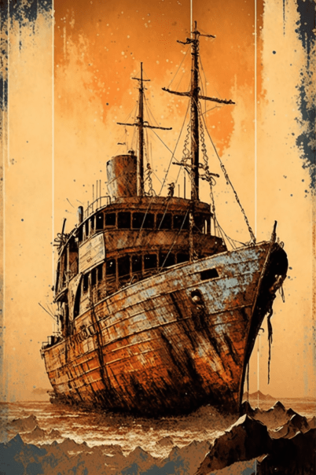

# 离开(天启)  
> 一条通往童话的小路...  
  
<table class="table table-bordered" data-toggle="table"  data-show-header="false"><thead style="display:none"><tr ><th  style="width:50%;text-align:left;vertical-align:top;"  >title</th><th  style="width:50%;text-align:left;vertical-align:top;"  ></th></tr></thead><tr ><td  style="width:50%;text-align:left;vertical-align:top;"  >** 区域唯一 **  ** 不可删除 **</td><td  style="width:50%;text-align:left;vertical-align:top;"  >

<a href="tq_Path_FlowerSea_Retern.md" style="color:black">离开</a>

</td></tr></tbody></table>  
  
## 获取来源  

触碰

[彩虹花](tq_Nc_PollenSeason_Flower_RainBowFlower.md)

Go

[前往浅滩](tq_Path_RainBowFlowerToFlowerSea.md)

  
  
## 动作  

<table><tr><td rowspan="2" style="width:200px;text-align:center;font-size:1.3em;font-weight:bold">

Go

15分

</td><td>[“旅行动作(组)”](TravelAction.md)</td></tr><tr><td></td></tr><tr><td colspan="2"><b>需求：</b>[

[光亮](Light.md)](Light.md): <b>10-100</b>, [

[耐力](Stamina.md)](Stamina.md): <b>11-32</b></td></tr><tr><td colspan="2"><b>状态变化：</b>[

[足部损伤](FootDamage.md)](FootDamage.md)<b>+20</b>, [

[耐力](Stamina.md)](Stamina.md)<b>-4</b>, [

[压力](Stress.md)](Stress.md)<b>-10</b>, [

[猎手接近](HuntersProximity.md)](HuntersProximity.md)<b>-6</b></td></tr><tr><td colspan="2">

<table style="margin-bottom:3px;"><tr><td rowspan=2 style="text-align:center" width="80px">
基础权重

1
</td><td style="font-size:0.6em;line-height:0.6em;font-weight:bold">Path</td></tr><tr><td>[

[丛林(环境)](Env_Jungle.md)](Env_Jungle.md)(<b>+1</b>), [

[前往海湾(丛林)](Path_JungleToBay.md)](Path_JungleToBay.md)(<b>+1</b>)</td></tr></table>

<table style="margin-bottom:3px;"><tr><td rowspan=2 style="text-align:center" width="80px">
基础权重

0
</td><td style="font-size:0.6em;line-height:0.6em;font-weight:bold">Lola_StartStory_StepSeven_ToRuins_Ship</td></tr><tr><td>[

[破败轮船(环境)](cod_Env_破旧轮船.md)](cod_Env_破旧轮船.md)(<b>+1</b>), [

[Storm](tq_Wather_StromRain.md)](tq_Wather_StromRain.md)(<b>+1</b>)</td></tr><tr><td colspan=2><li>[DisasterBeason_ToShipCounter](cod_Gs_Ruins_DisasterBeason_StartJourneyCounter.md)为<b>1</b>时权重<b>+100000</b></li></td></tr></table>
<button class="btn btn-secondary btn-sm" style="" data-toggle="modal" onclick="setCollectionDataBase64('eyJ0aXRsZSI6IuamgueOh+aooeaLnzogR28gKOemu+W8gCkiLCJjb2xsZWN0aW9ucyI6W3siZHJvcCI6IjxkaXYgc3R5bGU9XCJ3aWR0aDoyNXB4O2Rpc3BsYXk6aW5saW5lLWJsb2NrO3RleHQtYWxpZ246Y2VudGVyXCI+PGltZyBkZWNvZGluZz1cImFzeW5jXCIgc3JjPVwiU3ByaXRlL0p1bmdsZS5wbmdcIiBocmVmPVwiYS5tZFwiIHN0eWxlPVwibWF4LXdpZHRoOjI1cHg7bWF4LWhlaWdodDoyNXB4O1wiPjwvZGl2PuS4m+aelyjnjq/looMpPGRpdiBzdHlsZT1cIndpZHRoOjI1cHg7ZGlzcGxheTppbmxpbmUtYmxvY2s7dGV4dC1hbGlnbjpjZW50ZXJcIj48aW1nIGRlY29kaW5nPVwiYXN5bmNcIiBzcmM9XCJTcHJpdGUvUGF0aE91dHNraXJ0VG9CZWFjaC5wbmdcIiBocmVmPVwiYS5tZFwiIHN0eWxlPVwibWF4LXdpZHRoOjI1cHg7bWF4LWhlaWdodDoyNXB4O1wiPjwvZGl2PuWJjeW+gOa1t+a5vijkuJvmnpcpIiwiYmFzZSI6MSwiY29uZGl0aW9uIjpbXX0seyJkcm9wIjoiPGRpdiBzdHlsZT1cIndpZHRoOjI1cHg7ZGlzcGxheTppbmxpbmUtYmxvY2s7dGV4dC1hbGlnbjpjZW50ZXJcIj48aW1nIGRlY29kaW5nPVwiYXN5bmNcIiBzcmM9XCJTcHJpdGUvY29kL2FsX+W6n+W8g+mCrui9ri5wbmdcIiBocmVmPVwiYS5tZFwiIHN0eWxlPVwibWF4LXdpZHRoOjI1cHg7bWF4LWhlaWdodDoyNXB4O1wiPjwvZGl2PuegtOi0pei9ruiIuSjnjq/looMpKGNvZF9FbnZf56C05pen6L2u6Ii5Lm1kKShjb2RfRW52X+egtOaXp+i9ruiIuS5tZCk8ZGl2IHN0eWxlPVwid2lkdGg6MjVweDtkaXNwbGF5OmlubGluZS1ibG9jazt0ZXh0LWFsaWduOmNlbnRlclwiPjxpbWcgZGVjb2Rpbmc9XCJhc3luY1wiIHNyYz1cIlNwcml0ZS9XZWF0aGVyU3Rvcm1fMC5wbmdcIiBocmVmPVwiYS5tZFwiIHN0eWxlPVwibWF4LXdpZHRoOjI1cHg7bWF4LWhlaWdodDoyNXB4O1wiPjwvZGl2PlN0b3JtIiwiYmFzZSI6MCwiY29uZGl0aW9uIjpbeyJrZXkiOiJjb2RfR3NfUnVpbnNfRGlzYXN0ZXJCZWFzb25fU3RhcnRKb3VybmV5Q291bnRlciIsInRpdGxlIjoiRGlzYXN0ZXJCZWFzb25fVG9TaGlwQ291bnRlciIsInR5cGUiOiJyYW5nZSIsIm1heCI6WzAsMV0sInJhbmdlIjpbMSwxXSwid2VpZ2h0IjpbMTAwMDAwLDEwMDAwMF0sImRlZmF1bHRWYWx1ZSI6MCwid2hlbk91dE9mUmFuZ2UiOjB9XX1dfQ==')" data-target="#modelCollectionSimulator">概率模拟</button>
</td></tr></table>
  
  
  

