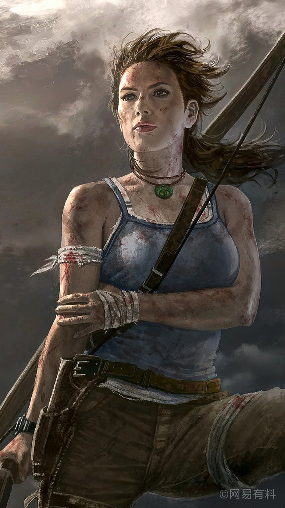

## 罗拉·克劳芬  

<table style="margin-bottom:0px;"><tr><td rowspan=2 style="width:160px"></td><td style="font-size:1.8em"><b>罗拉·克劳芬</b></td><td style="width:50%">解锁价格：1☀️</td></tr><tr><td  colspan=2 style=""><i>劳拉，世界语言学者与考古学家。自幼时有一个圆满的家庭，但这一切都在某次事故后改变了。当年父亲执着于长生不死的传说而身败名裂甚至众叛亲离，那时小时候的劳拉无法理解他的所作所为。随时间流逝，劳拉走过了邪马台、见证过百慕大、科特兹失落之城后。现在的她明白了父亲所说的话可能为真。为了完成父亲的研究并洗刷他的冤屈，劳拉决定独自前往位于印度尼西亚西北边境的未知岛屿，探寻事件的真相。</i></td><tr><td colspan=2><b>初始环境：</b>[

[飓风海域](tq_Exp_OverTheDeepSea.md)](tq_Exp_OverTheDeepSea.md)<td colspan=1><b>初始天气：</b>[

[风暴](tq_Wather_StromRain.md)](tq_Wather_StromRain.md)</tr></tr><tr><td colspan=3><b>初始特性：</b>

[乐观主义](Pk_4_Optimist.md)

[独来独往](Pk_4_Loner.md)

[抗虫体质](Pk_4_BugResistant.md)

[长矛手](Pk_5_SpearFighter.md)

[弓箭手](Pk_5_Archer.md)

[药草学者](Pk_5_Herbologist.md)

[工匠](Pk_5_Crafting.md)

[天启](tq_DiasterBaeconsPerk.md)

[脚踏实地](Pk_4_DownToEarth.md)

[痛苦耐受](Pk_4_PainTolerance.md)

[攀岩者](Pk_5_Climber.md)

[勇敢](Pk_4_Brave.md)

[旅途](tq_DiasterBeason_LolaStart.md)

  
  
</tr><tr><td colspan=3><b>初始衣物：</b> 

<a href="MilitaryBoots.md" style="color:black">军靴</a>

<a href="MilitaryPants.md" style="color:black">军裤</a>

<a href="tq_Nc_DiasterBeacons_Lola_Bag.md" style="color:black">旅途背包</a>

<a href="tq_Nc_DiasterBeacons_Lola_Bottle.md" style="color:black">旅行水壶</a>

<a href="ShirtFiber.md" style="color:black">衬衫</a>

<a href="Socks.md" style="color:black">袜子</a>

<a href="Underwear.md" style="color:black">内裤</a>

  
  
</tr><tr><td colspan=3><b>初始卡牌：</b> 

<a href="tq_Nc_DiasterBeacons.md" style="color:black">天启</a>

<a href="tq_Event_Character_Lola_StartEpisode_Drowning_StepOne.md" style="color:black">飓风</a>

  
  
</tr><tr><td colspan=3><b>初始蓝图：</b> 

<a href="Bp_Bow.md" style="color:black">弓</a>

<a href="Bp_Arrow.md" style="color:black">箭矢</a>

<a href="Bp_AloeGel.md" style="color:black">芦荟膏</a>

<a href="Bp_BugRepellent.md" style="color:black">驱虫膏</a>

<a href="Bp_CropPlot.md" style="color:black">农田</a>

<a href="Bp_PesticideChilli.md" style="color:black">辣椒农药</a>

<a href="Bp_CompostBin.md" style="color:black">堆肥箱</a>

  
  
</tr></table>
    
  
## 目标  

