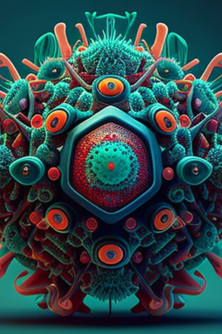

# 狼人血统(天启)  
> 我想吃肉....我想.....熬呜！  
  
<table class="table table-bordered" data-toggle="table"  data-show-header="false"><thead style="display:none"><tr ><th  style="width:50%;text-align:left;vertical-align:top;"  >title</th><th  style="width:50%;text-align:left;vertical-align:top;"  ></th></tr></thead><tr ><td  style="width:50%;text-align:left;vertical-align:top;"  >** 区域唯一 **  ** 不可删除 **  ** 装备时等效于拿在手上 **  **装备：**  **槽位：**1  **可用次数：**0  ** 效果: ** [

[光亮](Light.md)](Light.md)<b>+50</b> [

[护甲](Armor.md)](Armor.md)<b>+30</b> [

[免疫系统](ImmuneSystem.md)](ImmuneSystem.md) [

[狂躁](Mania.md)](Mania.md)加成<b>+1</b> [

[足茧](CallousesFeet.md)](CallousesFeet.md)<b>+500</b> [

[烧伤](Burns.md)](Burns.md)加成<b>-1</b> [

[肉类<nobr>厌倦度</nobr>](SaturationMeat.md)](SaturationMeat.md)加成<b>-1</b> [

[鱼类<nobr>厌倦度</nobr>](SaturationFish.md)](SaturationFish.md)加成<b>-1</b> [

[爬行类厌倦度](SaturationReptile.md)](SaturationReptile.md)加成<b>-1</b> [

[过热](Hyperthermia.md)](Hyperthermia.md)加成<b>-5</b> [

[失温](Hypothermia.md)](Hypothermia.md)加成<b>-5</b></td><td  style="width:50%;text-align:left;vertical-align:top;"  >

<a href="tq_W_BloodWolfViur_StepThree.md" style="color:black">狼人血统</a>

</td></tr></tbody></table>  
  
## 获取来源  

我感觉身体产生了一些变化...

[未知病毒](tq_W_BloodWolfViur_StepTwo.md)

  
  
## 属性   

<table style="margin-bottom:0px;"><tr><td style="width:30%;text-align:left; background-color:#FEFEFE;font-size:1.3em;font-weight:bold;">

</td><td style="font-size:1em;background-color:#FEFEFE">初始：0 , 最大：96 每15分钟+1 , 最多需要：1天</td></tr><tr style="background-color:#FFFFFF"><td colspan=2>** 到达上限时：狼人自愈 ** 自身: 

  <b>-96(-100%)</b></td></tr></table>
  

<table style="margin-bottom:0px;"><tr><td style="width:30%;text-align:left; background-color:#FEFEFE;font-size:1.3em;font-weight:bold;">

</td><td style="font-size:1em;background-color:#FEFEFE">初始：0 , 最大：0 每15分钟+0 , 最多需要：NaN天</td></tr><tr style="background-color:#FFFFFF"><td colspan=2></td></tr></table>
  

<table style="margin-bottom:0px;"><tr><td style="width:30%;text-align:left; background-color:#FEFEFE;font-size:1.3em;font-weight:bold;">

</td><td style="font-size:1em;background-color:#FEFEFE">初始：0 , 最大：0 每15分钟-1 , 最多需要：-</td></tr><tr style="background-color:#FFFFFF"><td colspan=2></td></tr></table>
  

