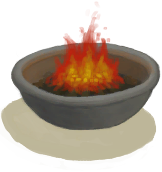

# 触发器  

<table><tr style="background-color:#F8F8F8"><td><b>死亡</b></td></tr><tr><td><b>触发条件：</b>[

[水分](Hydration.md)](Hydration.md): <b>0-0</b></td></tr></table>
  

<table><tr style="background-color:#F8F8F8"><td><b>死亡</b></td></tr><tr><td><b>触发条件：</b>[

[失温](Hypothermia.md)](Hypothermia.md): <b>100-100</b></td></tr><tr><td>[

[死亡(事件)](Event_DeathHypothermia.md)](Event_DeathHypothermia.md)(<b>+1</b>)</td></tr></table>
  

<table><tr style="background-color:#F8F8F8"><td><b>死亡</b></td></tr><tr><td><b>触发条件：</b>[

[体重](Weight.md)](Weight.md): <b>0-0</b></td></tr><tr><td>[

[死亡(事件)](Event_DeathNutrition.md)](Event_DeathNutrition.md)(<b>+1</b>)</td></tr></table>
  

<table><tr style="background-color:#F8F8F8"><td><b>到达目的地</b></td></tr><tr><td><b>触发条件：</b>[

[距离](Distance.md)](Distance.md): <b>2016-2016</b></td></tr><tr><td><b>触发后：</b>[睡眠中断](SleepInterrupt.md)<b>+1</b></td></tr><tr><td>[

[有船来了！(事件)](Event_ShipRescueDistance.md)](Event_ShipRescueDistance.md)(<b>+1</b>)</td></tr></table>
  

<table><tr style="background-color:#F8F8F8"><td><b>岩滩探索进度</b></td></tr><tr><td><b>触发条件：</b></td></tr><tr><td>[

[洞穴(事件)(岩滩)](Event_CaveFound.md)](Event_CaveFound.md)(<b>+0</b>)</td></tr></table>
  

<table><tr style="background-color:#F8F8F8"><td><b>海洋探索进度</b></td></tr><tr><td><b>触发条件：</b>[探索岩滩](Exploration_Rocks.md): <b>20-20</b></td></tr><tr><td>[

[沉船(事件)](Event_ShipwreckFound.md)](Event_ShipwreckFound.md)(<b>+0</b>)</td></tr></table>
  

<table><tr style="background-color:#F8F8F8"><td><b>晕倒</b></td></tr><tr><td><b>触发条件：</b>[

[耐力](Stamina.md)](Stamina.md): <b>0-0</b>, [晕倒次数](FaintCounter.md): <b>0-0</b></td></tr><tr><td><b>触发后：</b>[晕倒次数](FaintCounter.md)<b>+33</b></td></tr><tr><td>[

[你昏过去了(事件)](Event_FaintExhaustion.md)](Event_FaintExhaustion.md)(<b>+1</b>)</td></tr></table>
  

<table><tr style="background-color:#F8F8F8"><td><b>一具骷髅！</b></td></tr><tr><td><b>触发条件：</b>[

[饱食](Satiation.md)](Satiation.md): <b>0-1000</b>, [

[骷髅(坑洞)](Skeleton.md)](Skeleton.md)存在于手中/面板</td></tr><tr><td>[

[一具骷髅！(事件)(坑洞)](Event_SkeletonSeen.md)](Event_SkeletonSeen.md)(<b>+1</b>)</td></tr></table>
  

<table><tr style="background-color:#F8F8F8"><td><b>死亡</b></td></tr><tr><td><b>触发条件：</b>[

[真人秀直播](TV_Lives.md)](TV_Lives.md): <b>0-0</b></td></tr><tr><td>[

[受到来自项圈的伤害！(事件)](Event_TVNerveDamageDead.md)](Event_TVNerveDamageDead.md)(<b>+1</b>)</td></tr></table>
  

<table><tr style="background-color:#F8F8F8"><td><b>重置真人秀</b></td></tr><tr><td><b>触发条件：</b>[

[真人秀直播](TV_Lives.md)](TV_Lives.md): <b>1-1</b></td></tr><tr><td>[

[受到来自项圈的伤害！(事件)](Event_TVNerveDamageLegs.md)](Event_TVNerveDamageLegs.md)(<b>+1</b>)</td></tr></table>
  

<table><tr style="background-color:#F8F8F8"><td><b>重置真人秀</b></td></tr><tr><td><b>触发条件：</b>[

[真人秀直播](TV_Lives.md)](TV_Lives.md): <b>2-2</b></td></tr><tr><td>[

[受到来自项圈的伤害！(事件)](Event_TVNerveDamageHands.md)](Event_TVNerveDamageHands.md)(<b>+1</b>)</td></tr></table>
  

<table><tr style="background-color:#F8F8F8"><td><b>真人秀经理</b></td></tr><tr><td><b>触发条件：</b>[

[真人秀 - 等待](TV_CounterWait.md)](TV_CounterWait.md): <b>288-288</b></td></tr><tr><td><b>触发后：</b>[阻止抽到陨石坑事件](TV_CrateKiller.md)<b>-1</b></td></tr><tr><td>

<table style="margin-bottom:3px;"><tr><td rowspan=2 style="text-align:center" width="80px">
基础权重

1
</td><td style="font-size:0.6em;line-height:0.6em;font-weight:bold">Jungle</td></tr><tr><td>[

[掉落的空投 — 丛林(事件)](Event_TVPackageJungle.md)](Event_TVPackageJungle.md)(<b>+1</b>)[

[真人秀 丛林](TV_Jungle.md)](TV_Jungle.md)<b>+1</b> [真人秀 丛林 - 探索](TV_JungleExplore.md)<b>-20</b> [

[真人秀 - 包裹倒计时](TV_CounterRush.md)](TV_CounterRush.md)<b>-288</b></td></tr><tr><td colspan=2><li>[真人秀舞台](TV_Stage.md)为<b>0～7</b>时权重<b>-1</b></li></td></tr></table>

<table style="margin-bottom:3px;"><tr><td rowspan=2 style="text-align:center" width="80px">
基础权重

1
</td><td style="font-size:0.6em;line-height:0.6em;font-weight:bold">Rocks</td></tr><tr><td>[

[掉落的空投 — 岩滩(事件)](Event_TVPackageRocks.md)](Event_TVPackageRocks.md)(<b>+1</b>)[

[真人秀 - 岩滩](TV_Rocks.md)](TV_Rocks.md)<b>+1</b> [真人秀 石滩 - 探索](TV_RocksExplore.md)<b>-20</b> [

[真人秀 - 包裹倒计时](TV_CounterRush.md)](TV_CounterRush.md)<b>-288</b></td></tr><tr><td colspan=2><li>[真人秀舞台](TV_Stage.md)为<b>0～7</b>时权重<b>-1</b></li></td></tr></table>

<table style="margin-bottom:3px;"><tr><td rowspan=2 style="text-align:center" width="80px">
基础权重

1
</td><td style="font-size:0.6em;line-height:0.6em;font-weight:bold">Mangroves</td></tr><tr><td>[

[掉落的空投 — 红树林(事件)](Event_TVPackageMangroves.md)](Event_TVPackageMangroves.md)(<b>+1</b>)[

[真人秀 红树林](TV_Mangroves.md)](TV_Mangroves.md)<b>+1</b> [真人秀 红树林 - 探索](TV_MangrovesExplore.md)<b>-20</b> [

[真人秀 - 包裹倒计时](TV_CounterRush.md)](TV_CounterRush.md)<b>-288</b></td></tr><tr><td colspan=2><li>[真人秀舞台](TV_Stage.md)为<b>0～7</b>时权重<b>-1</b></li></td></tr></table>

<table style="margin-bottom:3px;"><tr><td rowspan=2 style="text-align:center" width="80px">
基础权重

1
</td><td style="font-size:0.6em;line-height:0.6em;font-weight:bold">Grasslands</td></tr><tr><td>[

[掉落的空投 — 草原(事件)](Event_TVPackageGrasslands.md)](Event_TVPackageGrasslands.md)(<b>+1</b>)[

[真人秀 草原](TV_Grasslands.md)](TV_Grasslands.md)<b>+1</b> [真人秀 草原 - 探索](TV_GrasslandsExplore.md)<b>-20</b> [

[真人秀 - 包裹倒计时](TV_CounterRush.md)](TV_CounterRush.md)<b>-288</b></td></tr><tr><td colspan=2><li>[真人秀舞台](TV_Stage.md)为<b>0～7</b>时权重<b>-1</b></li></td></tr></table>

<table style="margin-bottom:3px;"><tr><td rowspan=2 style="text-align:center" width="80px">
基础权重

1
</td><td style="font-size:0.6em;line-height:0.6em;font-weight:bold">Highlands</td></tr><tr><td>[

[掉落的空投 — 高地(事件)](Event_TVPackageHighlands.md)](Event_TVPackageHighlands.md)(<b>+1</b>)[

[真人秀 高地](TV_Highlands.md)](TV_Highlands.md)<b>+1</b> [真人秀 高地 - 探索](TV_HighlandsExplore.md)<b>-20</b> [

[真人秀 - 包裹倒计时](TV_CounterRush.md)](TV_CounterRush.md)<b>-288</b></td></tr><tr><td colspan=2><li>[真人秀舞台](TV_Stage.md)为<b>0～7</b>时权重<b>-1</b></li></td></tr></table>

<table style="margin-bottom:3px;"><tr><td rowspan=2 style="text-align:center" width="80px">
基础权重

0
</td><td style="font-size:0.6em;line-height:0.6em;font-weight:bold">Highlands Victory</td></tr><tr><td>[

[掉落的空投 — 高地(事件)](Event_TVPackageHighlands.md)](Event_TVPackageHighlands.md)(<b>+1</b>)[

[真人秀 高地](TV_Highlands.md)](TV_Highlands.md)<b>+1</b> [真人秀 高地 - 探索](TV_HighlandsExplore.md)<b>-20</b> [

[真人秀 - 包裹倒计时](TV_CounterRush.md)](TV_CounterRush.md)<b>-288</b></td></tr><tr><td colspan=2><li>[真人秀舞台](TV_Stage.md)为<b>8</b>时权重<b>+10000</b></li></td></tr></table>

</td></tr></table>
  

<table><tr style="background-color:#F8F8F8"><td><b>重置真人秀</b></td></tr><tr><td><b>触发条件：</b>[

[真人秀 - 包裹倒计时](TV_CounterRush.md)](TV_CounterRush.md): <b>288-288</b></td></tr><tr><td>[

[真人秀 - 等待](TV_CounterWait.md)](TV_CounterWait.md)<b>-287</b> [

[真人秀直播](TV_Lives.md)](TV_Lives.md)<b>-1</b> [阻止抽到陨石坑事件](TV_CrateKiller.md)<b>+1</b> [真人秀舞台](TV_Stage.md)<b>+1</b> [

[真人秀 高地](TV_Highlands.md)](TV_Highlands.md)<b>-1</b> [

[真人秀 丛林](TV_Jungle.md)](TV_Jungle.md)<b>-1</b> [

[真人秀 红树林](TV_Mangroves.md)](TV_Mangroves.md)<b>-1</b> [

[真人秀 - 岩滩](TV_Rocks.md)](TV_Rocks.md)<b>-1</b></td></tr></table>
  

<table><tr style="background-color:#F8F8F8"><td><b>胜利啦！</b></td></tr><tr><td><b>触发条件：</b>[真人秀舞台](TV_Stage.md): <b>10-10</b></td></tr></table>
  

<table><tr style="background-color:#F8F8F8"><td><b>一株外星植物！</b></td></tr><tr><td><b>触发条件：</b>[外星孢子](AlienSpores.md): <b>288-288</b></td></tr><tr><td><b>触发后：</b>[外星孢子](AlienSpores.md)<b>-288</b></td></tr><tr><td>[

[外星植物](AlienGrowthCleared.md)](AlienGrowthCleared.md)(<b>+1</b>)</td></tr></table>
  

<table><tr style="background-color:#F8F8F8"><td><b>失落</b></td></tr><tr><td><b>触发条件：</b>[

[压力](Stress.md)](Stress.md): <b>240-240</b>, [焦虑计数](AnxietyCounter.md): <b>0-0</b></td></tr><tr><td><b>触发后：</b>[焦虑计数](AnxietyCounter.md)<b>+96</b></td></tr><tr><td>[

[无法控制焦虑！(事件)](Event_AnxietyAttack.md)](Event_AnxietyAttack.md)(<b>+1</b>)</td></tr></table>
  

<table><tr style="background-color:#F8F8F8"><td><b>一头野猪！</b></td></tr><tr><td><b>触发条件：</b>[野猪袭击计时器](BoarRaidCounter.md): <b>192-192</b>, ~~位于[

[畜栏(环境)](Env_Enclosure.md)](Env_Enclosure.md)~~, ~~位于[

[木筏(环境)](Env_Raft.md)](Env_Raft.md)~~, ~~[

[门](Imp_Door.md)](Imp_Door.md)存在于手中/面板~~, [“饲料”](tag_Feed.md)存在于面板, [“浅水区”](tag_BoarTerritory.md)存在于手中/面板</td></tr><tr><td><b>触发后：</b>[野猪袭击计时器](BoarRaidCounter.md)<b>-192</b></td></tr><tr><td>

<table style="margin-bottom:3px;"><tr><td rowspan=2 style="text-align:center" width="80px">
基础权重

50
</td><td style="font-size:0.6em;line-height:0.6em;font-weight:bold">Nothing</td></tr><tr><td></td></tr></table>

<table style="margin-bottom:3px;"><tr><td rowspan=2 style="text-align:center" width="80px">
基础权重

0
</td><td style="font-size:0.6em;line-height:0.6em;font-weight:bold">Wild Boar Raiding</td></tr><tr><td>[

[一头野猪！(事件)](Event_BoarFightRaid.md)](Event_BoarFightRaid.md)(<b>+1</b>)</td></tr><tr><td colspan=2><li>[首月次数](FirstMonthCounter.md)为<b>0～5759</b>时权重<b>-1000</b></li><li>[野猪种群数量](Pop_Boar.md)为<b>0</b>时权重<b>-1000</b></li><li>[野猪种群数量](Pop_Boar.md)为<b>0～14000</b>时权重<b>-250～+0</b></li><li>[“饲料”](tag_Feed.md)存在于*手中/面板*，权重<b>+10</b>(可叠加),</li><li>[“农作物”](tag_Crop.md)存在于*手中/面板*，权重<b>+100</b>(可叠加),</li><li>[

[野参薯](YamPlant.md)](YamPlant.md)存在于*手中/面板*，权重<b>+50</b>(可叠加),</li></td></tr></table>

</td></tr></table>
  

<table><tr style="background-color:#F8F8F8"><td><b>船长的特别谈话1</b></td></tr><tr><td><b>触发条件：</b>[船长亲密关系](CaptainPropinquity.md): <b>2000-3000</b>, [睡眠钟](SleepClock.md): <b>1-999</b></td></tr><tr><td><b>触发后：</b>[睡眠中断](SleepInterrupt.md)<b>+1</b></td></tr><tr><td>[

[船长(Special1a)(事件)](Event_CaptainSpecial1a.md)](Event_CaptainSpecial1a.md)(<b>+1</b>)</td></tr></table>
  

<table><tr style="background-color:#F8F8F8"><td><b>出生</b></td></tr><tr><td><b>触发条件：</b>[

[怀孕](Pregnancy.md)](Pregnancy.md): <b>8640-8640</b></td></tr></table>
  

<table><tr style="background-color:#F8F8F8"><td><b>呕吐</b></td></tr><tr><td><b>触发条件：</b>[

[恶心](Nausea.md)](Nausea.md): <b>20-24</b>, [呕吐次数](VomitCounter.md): <b>0-0</b></td></tr><tr><td><b>触发后：</b>[呕吐次数](VomitCounter.md)<b>+4</b></td></tr><tr><td>[

[呕吐！(事件)](Event_Vomit.md)](Event_Vomit.md)(<b>+1</b>)</td></tr></table>
  

<table><tr style="background-color:#F8F8F8"><td><b>无人机！</b></td></tr><tr><td><b>触发条件：</b>[无人机袭击计数器](DroneRaidCounter.md): <b>192-192</b>, [

[遮蔽](Sheltered.md)](Sheltered.md): <b>0-0</b>, ~~位于[

[畜栏(环境)](Env_Enclosure.md)](Env_Enclosure.md)~~, ~~位于[

[木筏(环境)](Env_Raft.md)](Env_Raft.md)~~</td></tr><tr><td><b>触发后：</b>[无人机袭击计数器](DroneRaidCounter.md)<b>-191</b></td></tr><tr><td>

<table style="margin-bottom:3px;"><tr><td rowspan=2 style="text-align:center" width="80px">
基础权重

500
</td><td style="font-size:0.6em;line-height:0.6em;font-weight:bold">Nothing</td></tr><tr><td></td></tr><tr><td colspan=2><li>位于[

[丛林边缘(环境)](Env_Outskirts.md)](Env_Outskirts.md)权重<b>+100</b>,</li><li>位于[

[红树林(环境)](Env_Mangroves.md)](Env_Mangroves.md)权重<b>+175</b>,</li><li>位于[

[丛林(环境)](Env_Jungle.md)](Env_Jungle.md)权重<b>+250</b>,</li><li>位于[

[湿地(环境)](Env_Wetlands.md)](Env_Wetlands.md)权重<b>+325</b>,</li><li>[

[营火](Campfire.md)](Campfire.md)存在于*手中/面板*，权重<b>-150</b>(可叠加),</li><li>[

[粘土火盆](ClayFirePit.md)](ClayFirePit.md)存在于*手中/面板*，权重<b>-150</b>(可叠加),</li></td></tr></table>

<table style="margin-bottom:3px;"><tr><td rowspan=2 style="text-align:center" width="80px">
基础权重

1000
</td><td style="font-size:0.6em;line-height:0.6em;font-weight:bold">Drone</td></tr><tr><td>[

[攻击无人机！(事件)](Event_DroneFight.md)](Event_DroneFight.md)(<b>+1</b>)</td></tr><tr><td colspan=2><li>[首月次数](FirstMonthCounter.md)为<b>0～1</b>时权重<b>-1000</b></li><li>[杀手无人机种群数量](Pop_Drone.md)为<b>0～999</b>时权重<b>-1000</b></li><li>[杀手无人机种群数量](Pop_Drone.md)为<b>1000～4000</b>时权重<b>-750～+0</b></li></td></tr></table>

</td></tr></table>
  

<table><tr style="background-color:#F8F8F8"><td><b>晕倒</b></td></tr><tr><td><b>触发条件：</b>[

[酒精](Alcohol.md)](Alcohol.md): <b>64-70</b>, [晕倒次数](FaintCounter.md): <b>0-0</b></td></tr><tr><td><b>触发后：</b>[晕倒次数](FaintCounter.md)<b>+33</b></td></tr><tr><td>[

[你昏过去了(事件)](Event_FaintDizzy.md)](Event_FaintDizzy.md)(<b>+1</b>)</td></tr></table>
  

<table><tr style="background-color:#F8F8F8"><td><b>睡着了</b></td></tr><tr><td><b>触发条件：</b>[

[清醒度](Wakefulness.md)](Wakefulness.md): <b>0-0</b></td></tr><tr><td>[

[你睡着了！(事件)](Event_FallingAsleep.md)](Event_FallingAsleep.md)(<b>+1</b>)</td></tr></table>
  

<table><tr style="background-color:#F8F8F8"><td><b>神性体验</b></td></tr><tr><td><b>触发条件：</b>[

[情绪](Morale.md)](Morale.md): <b>350-350</b>, [

[精神失常](MindState.md)](MindState.md): <b>150-300</b>, [

[神圣灵视](GodInsight.md)](GodInsight.md): <b>0-0</b>, [精神失常计数器](PsychoCounter.md): <b>0-0</b></td></tr><tr><td><b>触发后：</b>[精神失常计数器](PsychoCounter.md)<b>+96</b></td></tr><tr><td>[

[神圣灵视(事件)](Event_GodExperience1a.md)](Event_GodExperience1a.md)(<b>+1</b>)</td></tr></table>
  

<table><tr style="background-color:#F8F8F8"><td><b>追杀体验</b></td></tr><tr><td><b>触发条件：</b>[

[猎手接近](HuntersProximity.md)](HuntersProximity.md): <b>96-96</b>, [精神失常计数器](PsychoCounter.md): <b>0-0</b>, [夜晚](IsNight.md): <b>1-1</b></td></tr><tr><td><b>触发后：</b>[精神失常计数器](PsychoCounter.md)<b>+96</b>, [睡眠中断](SleepInterrupt.md)<b>+1</b></td></tr><tr><td>[

[猎手来了(事件)](Event_HunterFight.md)](Event_HunterFight.md)(<b>+1</b>)</td></tr></table>
  

<table><tr style="background-color:#F8F8F8"><td><b>被追杀体验</b></td></tr><tr><td><b>触发条件：</b>[

[孤立感](Isolation.md)](Isolation.md): <b>2881-8640</b>, [

[压力](Stress.md)](Stress.md): <b>193-240</b>, [

[精神失常](MindState.md)](MindState.md): <b>150-300</b>, [精神失常计数器](PsychoCounter.md): <b>0-0</b>, [

[光亮](Light.md)](Light.md): <b>1-100</b></td></tr><tr><td><b>触发后：</b>[

[猎手的注视](HunterInsight.md)](HunterInsight.md)<b>+1</b>, [精神失常计数器](PsychoCounter.md)<b>+96</b></td></tr></table>
  

<table><tr style="background-color:#F8F8F8"><td><b>一只猕猴！！</b></td></tr><tr><td><b>触发条件：</b>[猕猴入侵计数器](MacaqueRaidCounter.md): <b>192-192</b>, ~~位于[

[红树林(环境)](Env_Mangroves.md)](Env_Mangroves.md)~~, ~~[

[门](Imp_Door.md)](Imp_Door.md)存在于手中/面板~~, ~~位于[

[木筏(环境)](Env_Raft.md)](Env_Raft.md)~~, ~~位于[

[猕猴窝(环境)](Env_MacaqueDen.md)](Env_MacaqueDen.md)~~, ~~[“洞穴系统”](tag_EnvCaveSystem.md)存在于手中/面板~~, [“丛林”](tag_Jungle.md)存在于手中/面板</td></tr><tr><td><b>触发后：</b>[猕猴入侵计数器](MacaqueRaidCounter.md)<b>-192</b></td></tr><tr><td>

<table style="margin-bottom:3px;"><tr><td rowspan=2 style="text-align:center" width="80px">
基础权重

50
</td><td style="font-size:0.6em;line-height:0.6em;font-weight:bold">Nothing</td></tr><tr><td></td></tr></table>

<table style="margin-bottom:3px;"><tr><td rowspan=2 style="text-align:center" width="80px">
基础权重

0
</td><td style="font-size:0.6em;line-height:0.6em;font-weight:bold">Macaque Raid</td></tr><tr><td>[

[一只猕猴！(事件)](Event_MacaqueRaid.md)](Event_MacaqueRaid.md)(<b>+1</b>)</td></tr><tr><td colspan=2><li>[计数](Counter.md)为<b>0～48</b>时权重<b>-1000</b></li><li>[猕猴种群数量](Pop_Macaque.md)为<b>0</b>时权重<b>-1000</b></li><li>[猕猴种群数量](Pop_Macaque.md)为<b>0～25000</b>时权重<b>-100～+0</b></li><li>[Macaque Fear](MacaqueFear.md)为<b>0～3000</b>时权重限定为<b>+0～-1000</b></li><li>[“饲料”](tag_Feed.md)存在于*面板/不在容器中*，权重<b>+50</b>(可叠加),</li><li>[“美丽的/好看的”](tag_Pretty.md)存在于*面板/不在容器中*，权重<b>+25</b>(可叠加),</li><li>[“装饰品”](tag_Decoration.md)存在于*面板/不在容器中*，权重<b>+25</b>(可叠加),</li></td></tr></table>

<table style="margin-bottom:3px;"><tr><td rowspan=2 style="text-align:center" width="80px">
基础权重

0
</td><td style="font-size:0.6em;line-height:0.6em;font-weight:bold">Macaque Crop Attack</td></tr><tr><td>[

[一只猕猴！(事件)](Event_MacaqueRaid.md)](Event_MacaqueRaid.md)(<b>+1</b>)</td></tr><tr><td colspan=2><li>[首月次数](FirstMonthCounter.md)为<b>0～48</b>时权重<b>-1000</b></li><li>[猕猴种群数量](Pop_Macaque.md)为<b>0</b>时权重<b>-1000</b></li><li>[猕猴种群数量](Pop_Macaque.md)为<b>1000～25000</b>时权重<b>-150～+0</b></li><li>[Macaque Fear](MacaqueFear.md)为<b>0～2500</b>时权重限定为<b>+0～-200</b></li><li>[“农作物”](tag_Crop.md)存在于*手中/面板*，权重<b>+25</b>(可叠加),</li></td></tr></table>

</td></tr></table>
  

<table><tr style="background-color:#F8F8F8"><td><b>一头巨蜥！</b></td></tr><tr><td><b>触发条件：</b>[巨蜥袭击计时器](MonitorRaidCounter.md): <b>192-192</b>, ~~位于[

[畜栏(环境)](Env_Enclosure.md)](Env_Enclosure.md)~~, ~~位于[

[木筏(环境)](Env_Raft.md)](Env_Raft.md)~~, ~~[

[门](Imp_Door.md)](Imp_Door.md)存在于手中/面板~~, [“肉”](tag_Meat.md)存在于面板, [“巨蜥活动区域”](tag_MonitorTerritory.md)存在于手中/面板</td></tr><tr><td><b>触发后：</b>[巨蜥袭击计时器](MonitorRaidCounter.md)<b>-192</b></td></tr><tr><td>

<table style="margin-bottom:3px;"><tr><td rowspan=2 style="text-align:center" width="80px">
基础权重

50
</td><td style="font-size:0.6em;line-height:0.6em;font-weight:bold">Nothing</td></tr><tr><td></td></tr></table>

<table style="margin-bottom:3px;"><tr><td rowspan=2 style="text-align:center" width="80px">
基础权重

0
</td><td style="font-size:0.6em;line-height:0.6em;font-weight:bold">Monitor</td></tr><tr><td>[

[一头巨蜥！(事件)](Event_MonitorRaid.md)](Event_MonitorRaid.md)(<b>+1</b>)</td></tr><tr><td colspan=2><li>[首月次数](FirstMonthCounter.md)为<b>0～5759</b>时权重<b>-1000</b></li><li>[巨蜥种群数量](Pop_Monitor.md)为<b>0</b>时权重<b>-1000</b></li><li>[巨蜥种群数量](Pop_Monitor.md)为<b>0～14000</b>时权重<b>-250～+0</b></li><li>[“肉”](tag_Meat.md)存在于*面板*，权重<b>+10</b>(可叠加),</li></td></tr></table>

</td></tr></table>
  

<table><tr style="background-color:#F8F8F8"><td><b>鼠害！</b></td></tr><tr><td><b>触发条件：</b>[老鼠袭击次数](MouseDamageCounter.md): <b>192-192</b>, [

[距离](Distance.md)](Distance.md): <b>0-0</b>, ~~[

[门](Imp_Door.md)](Imp_Door.md)存在于手中/面板~~, ~~位于[

[鸟岩岛(环境)](Env_BirdRock.md)](Env_BirdRock.md)~~, [“饲料”](tag_Feed.md)存在于面板/不在容器中</td></tr><tr><td><b>触发后：</b>[老鼠袭击次数](MouseDamageCounter.md)<b>-192</b></td></tr><tr><td>

<table style="margin-bottom:3px;"><tr><td rowspan=2 style="text-align:center" width="80px">
基础权重

50
</td><td style="font-size:0.6em;line-height:0.6em;font-weight:bold">Nothing</td></tr><tr><td></td></tr></table>

<table style="margin-bottom:3px;"><tr><td rowspan=2 style="text-align:center" width="80px">
基础权重

0
</td><td style="font-size:0.6em;line-height:0.6em;font-weight:bold">Mouse</td></tr><tr><td>[

[鼠害(事件)](Event_MouseDamage.md)](Event_MouseDamage.md)(<b>+1</b>)</td></tr><tr><td colspan=2><li>[首月次数](FirstMonthCounter.md)为<b>0～1344</b>时权重<b>-1000</b></li><li>[老鼠种群数量](Pop_Mouse.md)为<b>0</b>时权重<b>-1000</b>，否则权重-1000000</li><li>[老鼠种群数量](Pop_Mouse.md)为<b>0～100000</b>时权重限定为<b>-150～+0</b></li><li>[“饲料”](tag_Feed.md)存在于*面板/不在容器中*，权重<b>+10</b>(可叠加),</li><li>[“农作物”](tag_Crop.md)存在于*手中/面板*，权重<b>+10</b>(可叠加),</li><li>[

[忠犬朋友](DogFriend.md)](DogFriend.md)存在于*手中/面板*，权重<b>-100</b>(可叠加),</li></td></tr></table>

</td></tr></table>
  

<table><tr style="background-color:#F8F8F8"><td><b>梦魇</b></td></tr><tr><td><b>触发条件：</b>[

[压力](Stress.md)](Stress.md): <b>193-240</b>, [睡眠钟](SleepClock.md): <b>1-14</b>, [梦魇计数器](NightmareCounter.md): <b>0-0</b></td></tr><tr><td><b>触发后：</b>[睡眠中断](SleepInterrupt.md)<b>+1</b>, [梦魇计数器](NightmareCounter.md)<b>+36～+144</b></td></tr><tr><td>[

[噩梦！(事件)](Event_Nightmare.md)](Event_Nightmare.md)(<b>+1</b>)</td></tr></table>
  

<table><tr style="background-color:#F8F8F8"><td><b>怀孕</b></td></tr><tr><td><b>触发条件：</b>[

[怀孕](Pregnancy.md)](Pregnancy.md): <b>8640-8640</b></td></tr><tr><td>[

[时候已到！(事件)](Event_Pregnancy.md)](Event_Pregnancy.md)(<b>+1</b>)</td></tr></table>
  

<table><tr style="background-color:#F8F8F8"><td><b>木筏事件</b></td></tr><tr><td><b>触发条件：</b>[

[距离](Distance.md)](Distance.md): <b>336-2016</b></td></tr><tr><td>

<table style="margin-bottom:3px;"><tr><td rowspan=2 style="text-align:center" width="80px">
基础权重

5
</td><td style="font-size:0.6em;line-height:0.6em;font-weight:bold">Atoll</td></tr><tr><td>[

[着陆预警！(事件)](Event_Raft_Atoll.md)](Event_Raft_Atoll.md)(<b>+1</b>)</td></tr></table>

<table style="margin-bottom:3px;"><tr><td rowspan=2 style="text-align:center" width="80px">
基础权重

20
</td><td style="font-size:0.6em;line-height:0.6em;font-weight:bold">Shark</td></tr><tr><td>[

[一条鲨鱼！(事件)](Event_Raft_SharkVisitor.md)](Event_Raft_SharkVisitor.md)(<b>+1</b>)</td></tr></table>

<table style="margin-bottom:3px;"><tr><td rowspan=2 style="text-align:center" width="80px">
基础权重

20
</td><td style="font-size:0.6em;line-height:0.6em;font-weight:bold">Debris</td></tr><tr><td>[

[漂浮的残骸！(事件)](Event_Raft_FloatingDebris.md)](Event_Raft_FloatingDebris.md)(<b>+1</b>)</td></tr></table>

<table style="margin-bottom:3px;"><tr><td rowspan=2 style="text-align:center" width="80px">
基础权重

5
</td><td style="font-size:0.6em;line-height:0.6em;font-weight:bold">Ship</td></tr><tr><td>[

[一艘路过的船！(事件)](Event_Raft_PassingShip.md)](Event_Raft_PassingShip.md)(<b>+1</b>)</td></tr></table>

</td></tr></table>
  

<table><tr style="background-color:#F8F8F8"><td><b>木筏事件</b></td></tr><tr><td><b>触发条件：</b>[

[距离](Distance.md)](Distance.md): <b>672-2016</b></td></tr><tr><td>

<table style="margin-bottom:3px;"><tr><td rowspan=2 style="text-align:center" width="80px">
基础权重

10
</td><td style="font-size:0.6em;line-height:0.6em;font-weight:bold">Atoll</td></tr><tr><td>[

[着陆预警！(事件)](Event_Raft_Atoll.md)](Event_Raft_Atoll.md)(<b>+1</b>)</td></tr></table>

<table style="margin-bottom:3px;"><tr><td rowspan=2 style="text-align:center" width="80px">
基础权重

20
</td><td style="font-size:0.6em;line-height:0.6em;font-weight:bold">Shark</td></tr><tr><td>[

[一条鲨鱼！(事件)](Event_Raft_SharkVisitor.md)](Event_Raft_SharkVisitor.md)(<b>+1</b>)</td></tr></table>

<table style="margin-bottom:3px;"><tr><td rowspan=2 style="text-align:center" width="80px">
基础权重

20
</td><td style="font-size:0.6em;line-height:0.6em;font-weight:bold">Debris</td></tr><tr><td>[

[漂浮的残骸！(事件)](Event_Raft_FloatingDebris.md)](Event_Raft_FloatingDebris.md)(<b>+1</b>)</td></tr></table>

<table style="margin-bottom:3px;"><tr><td rowspan=2 style="text-align:center" width="80px">
基础权重

10
</td><td style="font-size:0.6em;line-height:0.6em;font-weight:bold">Ship</td></tr><tr><td>[

[一艘路过的船！(事件)](Event_Raft_PassingShip.md)](Event_Raft_PassingShip.md)(<b>+1</b>)</td></tr></table>

</td></tr></table>
  

<table><tr style="background-color:#F8F8F8"><td><b>木筏事件</b></td></tr><tr><td><b>触发条件：</b>[

[距离](Distance.md)](Distance.md): <b>1008-2016</b></td></tr><tr><td>

<table style="margin-bottom:3px;"><tr><td rowspan=2 style="text-align:center" width="80px">
基础权重

15
</td><td style="font-size:0.6em;line-height:0.6em;font-weight:bold">Atoll</td></tr><tr><td>[

[着陆预警！(事件)](Event_Raft_Atoll.md)](Event_Raft_Atoll.md)(<b>+1</b>)</td></tr></table>

<table style="margin-bottom:3px;"><tr><td rowspan=2 style="text-align:center" width="80px">
基础权重

20
</td><td style="font-size:0.6em;line-height:0.6em;font-weight:bold">Shark</td></tr><tr><td>[

[一条鲨鱼！(事件)](Event_Raft_SharkVisitor.md)](Event_Raft_SharkVisitor.md)(<b>+1</b>)</td></tr></table>

<table style="margin-bottom:3px;"><tr><td rowspan=2 style="text-align:center" width="80px">
基础权重

20
</td><td style="font-size:0.6em;line-height:0.6em;font-weight:bold">Debris</td></tr><tr><td>[

[漂浮的残骸！(事件)](Event_Raft_FloatingDebris.md)](Event_Raft_FloatingDebris.md)(<b>+1</b>)</td></tr></table>

<table style="margin-bottom:3px;"><tr><td rowspan=2 style="text-align:center" width="80px">
基础权重

15
</td><td style="font-size:0.6em;line-height:0.6em;font-weight:bold">Ship</td></tr><tr><td>[

[一艘路过的船！(事件)](Event_Raft_PassingShip.md)](Event_Raft_PassingShip.md)(<b>+1</b>)</td></tr></table>

</td></tr></table>
  

<table><tr style="background-color:#F8F8F8"><td><b>木筏事件</b></td></tr><tr><td><b>触发条件：</b>[

[距离](Distance.md)](Distance.md): <b>1344-2016</b></td></tr><tr><td>

<table style="margin-bottom:3px;"><tr><td rowspan=2 style="text-align:center" width="80px">
基础权重

15
</td><td style="font-size:0.6em;line-height:0.6em;font-weight:bold">Atoll</td></tr><tr><td>[

[着陆预警！(事件)](Event_Raft_Atoll.md)](Event_Raft_Atoll.md)(<b>+1</b>)</td></tr></table>

<table style="margin-bottom:3px;"><tr><td rowspan=2 style="text-align:center" width="80px">
基础权重

20
</td><td style="font-size:0.6em;line-height:0.6em;font-weight:bold">Shark</td></tr><tr><td>[

[一条鲨鱼！(事件)](Event_Raft_SharkVisitor.md)](Event_Raft_SharkVisitor.md)(<b>+1</b>)</td></tr></table>

<table style="margin-bottom:3px;"><tr><td rowspan=2 style="text-align:center" width="80px">
基础权重

20
</td><td style="font-size:0.6em;line-height:0.6em;font-weight:bold">Debris</td></tr><tr><td>[

[漂浮的残骸！(事件)](Event_Raft_FloatingDebris.md)](Event_Raft_FloatingDebris.md)(<b>+1</b>)</td></tr></table>

<table style="margin-bottom:3px;"><tr><td rowspan=2 style="text-align:center" width="80px">
基础权重

20
</td><td style="font-size:0.6em;line-height:0.6em;font-weight:bold">Ship</td></tr><tr><td>[

[一艘路过的船！(事件)](Event_Raft_PassingShip.md)](Event_Raft_PassingShip.md)(<b>+1</b>)</td></tr></table>

</td></tr></table>
  

<table><tr style="background-color:#F8F8F8"><td><b>木筏事件</b></td></tr><tr><td><b>触发条件：</b>[

[距离](Distance.md)](Distance.md): <b>1680-2016</b></td></tr><tr><td>

<table style="margin-bottom:3px;"><tr><td rowspan=2 style="text-align:center" width="80px">
基础权重

15
</td><td style="font-size:0.6em;line-height:0.6em;font-weight:bold">Atoll</td></tr><tr><td>[

[着陆预警！(事件)](Event_Raft_Atoll.md)](Event_Raft_Atoll.md)(<b>+1</b>)</td></tr></table>

<table style="margin-bottom:3px;"><tr><td rowspan=2 style="text-align:center" width="80px">
基础权重

20
</td><td style="font-size:0.6em;line-height:0.6em;font-weight:bold">Shark</td></tr><tr><td>[

[一条鲨鱼！(事件)](Event_Raft_SharkVisitor.md)](Event_Raft_SharkVisitor.md)(<b>+1</b>)</td></tr></table>

<table style="margin-bottom:3px;"><tr><td rowspan=2 style="text-align:center" width="80px">
基础权重

20
</td><td style="font-size:0.6em;line-height:0.6em;font-weight:bold">Debris</td></tr><tr><td>[

[漂浮的残骸！(事件)](Event_Raft_FloatingDebris.md)](Event_Raft_FloatingDebris.md)(<b>+1</b>)</td></tr></table>

<table style="margin-bottom:3px;"><tr><td rowspan=2 style="text-align:center" width="80px">
基础权重

20
</td><td style="font-size:0.6em;line-height:0.6em;font-weight:bold">Ship</td></tr><tr><td>[

[一艘路过的船！(事件)](Event_Raft_PassingShip.md)](Event_Raft_PassingShip.md)(<b>+1</b>)</td></tr></table>

</td></tr></table>
  

<table><tr style="background-color:#F8F8F8"><td><b>一头海怪！</b></td></tr><tr><td><b>触发条件：</b>[海怪入侵计数器](SeaHoundRaidCounter.md): <b>192-192</b>, [

[遮蔽](Sheltered.md)](Sheltered.md): <b>0-0</b>, ~~位于[

[畜栏(环境)](Env_Enclosure.md)](Env_Enclosure.md)~~, ~~[

[门](Imp_Door.md)](Imp_Door.md)存在于手中/面板~~, [“可能出现海鸥”](tag_Coastal.md)存在于手中/面板</td></tr><tr><td><b>触发后：</b>[海怪入侵计数器](SeaHoundRaidCounter.md)<b>-191</b></td></tr><tr><td>

<table style="margin-bottom:3px;"><tr><td rowspan=2 style="text-align:center" width="80px">
基础权重

100
</td><td style="font-size:0.6em;line-height:0.6em;font-weight:bold">Nothing</td></tr><tr><td></td></tr></table>

<table style="margin-bottom:3px;"><tr><td rowspan=2 style="text-align:center" width="80px">
基础权重

0
</td><td style="font-size:0.6em;line-height:0.6em;font-weight:bold">Seahound</td></tr><tr><td>[

[一头海怪！(事件)](Event_SeahoundFight.md)](Event_SeahoundFight.md)(<b>+1</b>)</td></tr><tr><td colspan=2><li>[计数](Counter.md)为<b>0～1920</b>时权重<b>-1000</b></li><li>[海怪种群数量](Pop_Seahounds.md)为<b>0～999</b>时权重<b>-1000</b></li><li>[海怪种群数量](Pop_Seahounds.md)为<b>1000～4000</b>时权重<b>+50～+500</b>，否则权重-1000000</li></td></tr></table>

</td></tr></table>
  

<table><tr style="background-color:#F8F8F8"><td><b>一只海鸥！</b></td></tr><tr><td><b>触发条件：</b>[海鸥入侵计数器](SeagullRaidCounter.md): <b>192-192</b>, [

[距离](Distance.md)](Distance.md): <b>0-500</b>, [

[遮蔽](Sheltered.md)](Sheltered.md): <b>0-0</b>, ~~[

[门](Imp_Door.md)](Imp_Door.md)存在于手中/面板~~, [“饲料”](tag_Feed.md)存在于面板/不在容器中, [“可能出现海鸥”](tag_Coastal.md)存在于手中/面板</td></tr><tr><td><b>触发后：</b>[海鸥入侵计数器](SeagullRaidCounter.md)<b>-192</b></td></tr><tr><td>

<table style="margin-bottom:3px;"><tr><td rowspan=2 style="text-align:center" width="80px">
基础权重

50
</td><td style="font-size:0.6em;line-height:0.6em;font-weight:bold">Nothing</td></tr><tr><td></td></tr></table>

<table style="margin-bottom:3px;"><tr><td rowspan=2 style="text-align:center" width="80px">
基础权重

0
</td><td style="font-size:0.6em;line-height:0.6em;font-weight:bold">Seagull Raid</td></tr><tr><td>[

[一只海鸥！(事件)](Event_SeagullRaid.md)](Event_SeagullRaid.md)(<b>+1</b>)</td></tr><tr><td colspan=2><li>[首月次数](FirstMonthCounter.md)为<b>0～48</b>时权重<b>-1000</b></li><li>[海鸥种群数量](Pop_Seagull.md)为<b>0</b>时权重<b>-1000</b></li><li>[海鸥种群数量](Pop_Seagull.md)为<b>0～45000</b>时权重<b>-100～+0</b></li><li>[海鸥之惧](SeagullFear.md)为<b>0～10000</b>时权重限定为<b>+0～-1000</b></li><li>[“饲料”](tag_Feed.md)存在于*面板/不在容器中*，权重<b>+50</b>(可叠加),</li></td></tr></table>

<table style="margin-bottom:3px;"><tr><td rowspan=2 style="text-align:center" width="80px">
基础权重

0
</td><td style="font-size:0.6em;line-height:0.6em;font-weight:bold">Seagull Crop Attack</td></tr><tr><td>[

[一只海鸥！(事件)](Event_SeagullRaid.md)](Event_SeagullRaid.md)(<b>+1</b>)</td></tr><tr><td colspan=2><li>[首月次数](FirstMonthCounter.md)为<b>0～48</b>时权重<b>-1000</b></li><li>[海鸥种群数量](Pop_Seagull.md)为<b>0</b>时权重<b>-1000</b></li><li>[海鸥种群数量](Pop_Seagull.md)为<b>1000～45000</b>时权重<b>-150～+0</b></li><li>[海鸥之惧](SeagullFear.md)为<b>0～2500</b>时权重限定为<b>+0～-200</b></li><li>[“农作物”](tag_Crop.md)存在于*手中/面板*，权重<b>+25</b>(可叠加),</li></td></tr></table>

</td></tr></table>
  

<table><tr style="background-color:#F8F8F8"><td><b>一头野猪！</b></td></tr><tr><td><b>触发条件：</b>[季节](Seasons.md): <b>8641-8641</b></td></tr><tr><td><b>触发后：</b>[季节](Seasons.md)<b>-8641</b></td></tr></table>
  

<table><tr style="background-color:#F8F8F8"><td><b>蜘蛛</b></td></tr><tr><td><b>触发条件：</b>[睡眠风险](SleepRisk.md): <b>1-999</b>, [睡眠钟](SleepClock.md): <b>2-14</b></td></tr><tr><td>

<table style="margin-bottom:3px;"><tr><td rowspan=2 style="text-align:center" width="80px">
基础权重

100
</td><td style="font-size:0.6em;line-height:0.6em;font-weight:bold">No Spider</td></tr><tr><td></td></tr></table>

<table style="margin-bottom:3px;"><tr><td rowspan=2 style="text-align:center" width="80px">
基础权重

0
</td><td style="font-size:0.6em;line-height:0.6em;font-weight:bold">Spider</td></tr><tr><td>[

[一只蜘蛛咬了我！(事件)](Event_SpiderNight.md)](Event_SpiderNight.md)(<b>+1</b>)[睡眠中断](SleepInterrupt.md)<b>+1</b></td></tr><tr><td colspan=2>以下取最高1个：<li>[

[丛林](Jungle.md)](Jungle.md)存在于*手中/面板*，权重<b>+10</b>,</li><li>[

[湿地丛林(湿地)](Wetlands.md)](Wetlands.md)存在于*手中/面板*，权重<b>+10</b>,</li><li>[

[幽暗洞穴](DarkCave.md)](DarkCave.md)存在于*手中/面板*，权重<b>+20</b>,</li><li>[

[离开(坠毁的飞机)](PlaneCrashExit.md)](PlaneCrashExit.md)存在于*手中/面板*，权重<b>+5</b>,</li><li>[

[营火](Campfire.md)](Campfire.md)存在于*手中/面板*，权重<b>-50</b>,</li><li>[

[粘土火盆](ClayFirePit.md)](ClayFirePit.md)存在于*手中/面板*，权重<b>-50</b>,</li></td></tr></table>

</td></tr></table>
  

<table><tr style="background-color:#F8F8F8"><td><b>风暴来袭！</b></td></tr><tr><td><b>触发条件：</b>[风暴次数](StormCounter.md): <b>6-6</b>, [

[遮蔽](Sheltered.md)](Sheltered.md): <b>0-0</b>, [“可能出现海鸥”](tag_Coastal.md)存在于手中/面板</td></tr><tr><td><b>触发后：</b>[风暴次数](StormCounter.md)<b>-5</b></td></tr><tr><td>[

[风太大了！(事件)](Event_Storm.md)](Event_Storm.md)(<b>+1</b>)</td></tr></table>
  

<table><tr style="background-color:#F8F8F8"><td><b>风暴损失！</b></td></tr><tr><td><b>触发条件：</b>[海湾风暴](Storm_Bay.md): <b>1-1</b>, ~~[

[风暴](TropicalIsland_Storm.md)](TropicalIsland_Storm.md)存在于手中/面板~~, 位于[

[海湾(环境)](Env_Bay.md)](Env_Bay.md)</td></tr><tr><td>[

[风暴侵袭(事件)](Event_StormDamage.md)](Event_StormDamage.md)(<b>+1</b>)[海湾风暴](Storm_Bay.md)<b>-1</b></td></tr></table>
  

<table><tr style="background-color:#F8F8F8"><td><b>风暴损失！</b></td></tr><tr><td><b>触发条件：</b>[沙滩风暴](Storm_Beach.md): <b>1-1</b>, ~~[

[风暴](TropicalIsland_Storm.md)](TropicalIsland_Storm.md)存在于手中/面板~~, 位于[

[沙滩(环境)](Env_Beach.md)](Env_Beach.md)</td></tr><tr><td>[

[风暴侵袭(事件)](Event_StormDamage.md)](Event_StormDamage.md)(<b>+1</b>)[沙滩风暴](Storm_Beach.md)<b>-1</b></td></tr></table>
  

<table><tr style="background-color:#F8F8F8"><td><b>风暴损失！</b></td></tr><tr><td><b>触发条件：</b>[荒芜沙滩风暴](Storm_DesolateBeach.md): <b>1-1</b>, ~~[

[风暴](TropicalIsland_Storm.md)](TropicalIsland_Storm.md)存在于手中/面板~~, [

[荒芜沙滩](DesolateBeach.md)](DesolateBeach.md)存在于手中/面板</td></tr><tr><td>[

[风暴侵袭(事件)](Event_StormDamage.md)](Event_StormDamage.md)(<b>+1</b>)[荒芜沙滩风暴](Storm_DesolateBeach.md)<b>-1</b></td></tr></table>
  

<table><tr style="background-color:#F8F8F8"><td><b>风暴损失！</b></td></tr><tr><td><b>触发条件：</b>[红树林风暴](Storm_Mangroves.md): <b>1-1</b>, ~~[

[风暴](TropicalIsland_Storm.md)](TropicalIsland_Storm.md)存在于手中/面板~~, 位于[

[红树林(环境)](Env_Mangroves.md)](Env_Mangroves.md)</td></tr><tr><td>[

[风暴侵袭(事件)](Event_StormDamage.md)](Event_StormDamage.md)(<b>+1</b>)[红树林风暴](Storm_Mangroves.md)<b>-1</b></td></tr></table>
  

<table><tr style="background-color:#F8F8F8"><td><b>风暴损失！</b></td></tr><tr><td><b>触发条件：</b>[丛林边缘风暴](Storm_Outskirts.md): <b>1-1</b>, ~~[

[风暴](TropicalIsland_Storm.md)](TropicalIsland_Storm.md)存在于手中/面板~~, 位于[

[丛林边缘(环境)](Env_Outskirts.md)](Env_Outskirts.md)</td></tr><tr><td>[

[风暴侵袭(事件)](Event_StormDamage.md)](Event_StormDamage.md)(<b>+1</b>)[丛林边缘风暴](Storm_Outskirts.md)<b>-1</b></td></tr></table>
  

<table><tr style="background-color:#F8F8F8"><td><b>风暴损失！</b></td></tr><tr><td><b>触发条件：</b>[岩滩风暴](Storm_Rocks.md): <b>1-1</b>, ~~[

[风暴](TropicalIsland_Storm.md)](TropicalIsland_Storm.md)存在于手中/面板~~, 位于[

[岩滩(环境)](Env_Rocks.md)](Env_Rocks.md)</td></tr><tr><td>[

[风暴侵袭(事件)](Event_StormDamage.md)](Event_StormDamage.md)(<b>+1</b>)[岩滩风暴](Storm_Rocks.md)<b>-1</b></td></tr></table>
  

<table><tr style="background-color:#F8F8F8"><td><b>大浪来袭！</b></td></tr><tr><td><b>触发条件：</b>[波次](WaveCounter.md): <b>24-24</b>, [海风程度](SeaAgitation.md): <b>4-5</b></td></tr><tr><td><b>触发后：</b>[波次](WaveCounter.md)<b>-24</b></td></tr><tr><td>[

[巨浪击中了木筏！(事件)](Event_Wave.md)](Event_Wave.md)(<b>+1</b>)</td></tr></table>
  

<table><tr style="background-color:#F8F8F8"><td><b>虚假的现实</b></td></tr><tr><td><b>触发条件：</b>[

[失实症](Derealization.md)](Derealization.md): <b>101-1000</b>, [

[精神失常](MindState.md)](MindState.md): <b>150-300</b>, [

[虚空灵视](VoidInsight.md)](VoidInsight.md): <b>0-0</b>, [精神失常计数器](PsychoCounter.md): <b>0-0</b></td></tr><tr><td><b>触发后：</b>[精神失常计数器](PsychoCounter.md)<b>+96</b></td></tr><tr><td>[

[虚空灵视(事件)](Event_VoidExperience1a.md)](Event_VoidExperience1a.md)(<b>+1</b>)</td></tr></table>
  

<table><tr style="background-color:#F8F8F8"><td><b>监视体验</b></td></tr><tr><td><b>触发条件：</b>[

[监视者的凝视](WatchersGlare.md)](WatchersGlare.md): <b>96-96</b>, [精神失常计数器](PsychoCounter.md): <b>0-0</b></td></tr><tr><td><b>触发后：</b>[精神失常计数器](PsychoCounter.md)<b>+96</b>, [睡眠中断](SleepInterrupt.md)<b>+1</b></td></tr><tr><td>[

[监视者(事件)](Event_WatchedExperience1a.md)](Event_WatchedExperience1a.md)(<b>+1</b>)</td></tr></table>
  

<table><tr style="background-color:#F8F8F8"><td><b>被监视体验</b></td></tr><tr><td><b>触发条件：</b>[

[孤立感](Isolation.md)](Isolation.md): <b>2881-8640</b>, [

[压力](Stress.md)](Stress.md): <b>193-240</b>, [

[精神失常](MindState.md)](MindState.md): <b>150-300</b>, [精神失常计数器](PsychoCounter.md): <b>0-0</b>, [

[光亮](Light.md)](Light.md): <b>0-0</b></td></tr><tr><td><b>触发后：</b>[

[监视者的注视](WatcherInsight.md)](WatcherInsight.md)<b>+1</b>, [精神失常计数器](PsychoCounter.md)<b>+96</b></td></tr></table>
  

<table><tr style="background-color:#F8F8F8"><td><b>韦斯顿的特别谈话1</b></td></tr><tr><td><b>触发条件：</b>[韦斯顿亲密关系](WestonPropinquity.md): <b>2000-3000</b>, [睡眠钟](SleepClock.md): <b>1-999</b></td></tr><tr><td><b>触发后：</b>[睡眠中断](SleepInterrupt.md)<b>+1</b></td></tr><tr><td>[

[韦斯顿(Special1a)(事件)](Event_WestonSpecial1a.md)](Event_WestonSpecial1a.md)(<b>+1</b>)</td></tr></table>
  

<table><tr style="background-color:#F8F8F8"><td><b>箭术提升！</b></td></tr><tr><td><b>触发条件：</b>[

[箭术(技能)](Skill_Archery.md)](Skill_Archery.md): <b>10-150</b></td></tr><tr><td>[

[箭术提升了！(事件)](Event_SkillArchery1.md)](Event_SkillArchery1.md)(<b>+1</b>)</td></tr></table>
  

<table><tr style="background-color:#F8F8F8"><td><b>箭术提升！</b></td></tr><tr><td><b>触发条件：</b>[

[箭术(技能)](Skill_Archery.md)](Skill_Archery.md): <b>30-150</b></td></tr><tr><td>[

[箭术提升了！(事件)](Event_SkillArchery2.md)](Event_SkillArchery2.md)(<b>+1</b>)</td></tr></table>
  

<table><tr style="background-color:#F8F8F8"><td><b>箭术提升！</b></td></tr><tr><td><b>触发条件：</b>[

[箭术(技能)](Skill_Archery.md)](Skill_Archery.md): <b>70-150</b></td></tr><tr><td>[

[箭术提升了！(事件)](Event_SkillArchery3.md)](Event_SkillArchery3.md)(<b>+1</b>)</td></tr></table>
  

<table><tr style="background-color:#F8F8F8"><td><b>箭术提升！</b></td></tr><tr><td><b>触发条件：</b>[

[箭术(技能)](Skill_Archery.md)](Skill_Archery.md): <b>150-150</b></td></tr><tr><td>[

[箭术提升了！(事件)](Event_SkillArchery4.md)](Event_SkillArchery4.md)(<b>+1</b>)</td></tr></table>
  

<table><tr style="background-color:#F8F8F8"><td><b>烹饪技能提升！</b></td></tr><tr><td><b>触发条件：</b>[

[烹饪(技能)](Skill_Cooking.md)](Skill_Cooking.md): <b>10-150</b></td></tr><tr><td>[

[烹饪技能提升！(事件)](Event_SkillCooking1.md)](Event_SkillCooking1.md)(<b>+1</b>)</td></tr></table>
  

<table><tr style="background-color:#F8F8F8"><td><b>烹饪技能提升！</b></td></tr><tr><td><b>触发条件：</b>[

[烹饪(技能)](Skill_Cooking.md)](Skill_Cooking.md): <b>30-150</b></td></tr><tr><td>[

[烹饪技能提升！(事件)](Event_SkillCooking2.md)](Event_SkillCooking2.md)(<b>+1</b>)</td></tr></table>
  

<table><tr style="background-color:#F8F8F8"><td><b>烹饪技能提升！</b></td></tr><tr><td><b>触发条件：</b>[

[烹饪(技能)](Skill_Cooking.md)](Skill_Cooking.md): <b>70-150</b></td></tr><tr><td>[

[烹饪技能提升！(事件)](Event_SkillCooking3.md)](Event_SkillCooking3.md)(<b>+1</b>)</td></tr></table>
  

<table><tr style="background-color:#F8F8F8"><td><b>烹饪技能提升！</b></td></tr><tr><td><b>触发条件：</b>[

[烹饪(技能)](Skill_Cooking.md)](Skill_Cooking.md): <b>150-150</b></td></tr><tr><td>[

[烹饪技能提升！(事件)](Event_SkillCooking4.md)](Event_SkillCooking4.md)(<b>+1</b>)</td></tr></table>
  

<table><tr style="background-color:#F8F8F8"><td><b>制作提升！</b></td></tr><tr><td><b>触发条件：</b>[

[制作(技能)](Skill_Crafting.md)](Skill_Crafting.md): <b>10-150</b></td></tr><tr><td>[

[制作技能提升！(事件)](Event_SkillCrafting1.md)](Event_SkillCrafting1.md)(<b>+1</b>)</td></tr></table>
  

<table><tr style="background-color:#F8F8F8"><td><b>制作提升！</b></td></tr><tr><td><b>触发条件：</b>[

[制作(技能)](Skill_Crafting.md)](Skill_Crafting.md): <b>30-150</b></td></tr><tr><td>[

[制作技能提升！(事件)](Event_SkillCrafting2.md)](Event_SkillCrafting2.md)(<b>+1</b>)</td></tr></table>
  

<table><tr style="background-color:#F8F8F8"><td><b>制作提升！</b></td></tr><tr><td><b>触发条件：</b>[

[制作(技能)](Skill_Crafting.md)](Skill_Crafting.md): <b>70-150</b></td></tr><tr><td>[

[制作技能提升！(事件)](Event_SkillCrafting3.md)](Event_SkillCrafting3.md)(<b>+1</b>)</td></tr></table>
  

<table><tr style="background-color:#F8F8F8"><td><b>制作提升！</b></td></tr><tr><td><b>触发条件：</b>[

[制作(技能)](Skill_Crafting.md)](Skill_Crafting.md): <b>150-150</b></td></tr><tr><td>[

[制作技能提升！(事件)](Event_SkillCrafting4.md)](Event_SkillCrafting4.md)(<b>+1</b>)</td></tr></table>
  

<table><tr style="background-color:#F8F8F8"><td><b>钓鱼技能提升！</b></td></tr><tr><td><b>触发条件：</b>[

[钓鱼(技能)](Skill_Fishing.md)](Skill_Fishing.md): <b>10-150</b></td></tr><tr><td>[

[钓鱼技能提升！(事件)](Event_SkillFishing1.md)](Event_SkillFishing1.md)(<b>+1</b>)</td></tr></table>
  

<table><tr style="background-color:#F8F8F8"><td><b>钓鱼技能提升！</b></td></tr><tr><td><b>触发条件：</b>[

[钓鱼(技能)](Skill_Fishing.md)](Skill_Fishing.md): <b>30-150</b></td></tr><tr><td>[

[钓鱼技能提升！(事件)](Event_SkillFishing2.md)](Event_SkillFishing2.md)(<b>+1</b>)</td></tr></table>
  

<table><tr style="background-color:#F8F8F8"><td><b>钓鱼技能提升！</b></td></tr><tr><td><b>触发条件：</b>[

[钓鱼(技能)](Skill_Fishing.md)](Skill_Fishing.md): <b>70-150</b></td></tr><tr><td>[

[钓鱼技能提升！(事件)](Event_SkillFishing3.md)](Event_SkillFishing3.md)(<b>+1</b>)</td></tr></table>
  

<table><tr style="background-color:#F8F8F8"><td><b>钓鱼技能提升！</b></td></tr><tr><td><b>触发条件：</b>[

[钓鱼(技能)](Skill_Fishing.md)](Skill_Fishing.md): <b>150-150</b></td></tr><tr><td>[

[钓鱼技能提升！(事件)](Event_SkillFishing4.md)](Event_SkillFishing4.md)(<b>+1</b>)</td></tr></table>
  

<table><tr style="background-color:#F8F8F8"><td><b>药草学技能提升了！</b></td></tr><tr><td><b>触发条件：</b>[

[药草学(技能)](Skill_Herbology.md)](Skill_Herbology.md): <b>10-150</b></td></tr><tr><td>[

[药草学技能提升了！(事件)](Event_SkillHerbology1.md)](Event_SkillHerbology1.md)(<b>+1</b>)</td></tr></table>
  

<table><tr style="background-color:#F8F8F8"><td><b>药草学技能提升了！</b></td></tr><tr><td><b>触发条件：</b>[

[药草学(技能)](Skill_Herbology.md)](Skill_Herbology.md): <b>30-150</b></td></tr><tr><td>[

[药草学技能提升了！(事件)](Event_SkillHerbology2.md)](Event_SkillHerbology2.md)(<b>+1</b>)</td></tr></table>
  

<table><tr style="background-color:#F8F8F8"><td><b>药草学技能提升了！</b></td></tr><tr><td><b>触发条件：</b>[

[药草学(技能)](Skill_Herbology.md)](Skill_Herbology.md): <b>70-150</b></td></tr><tr><td>[

[药草学技能提升了！(事件)](Event_SkillHerbology3.md)](Event_SkillHerbology3.md)(<b>+1</b>)</td></tr></table>
  

<table><tr style="background-color:#F8F8F8"><td><b>药草学技能提升了！</b></td></tr><tr><td><b>触发条件：</b>[

[药草学(技能)](Skill_Herbology.md)](Skill_Herbology.md): <b>150-150</b></td></tr><tr><td>[

[药草学技能提升了！(事件)](Event_SkillHerbology4.md)](Event_SkillHerbology4.md)(<b>+1</b>)</td></tr></table>
  

<table><tr style="background-color:#F8F8F8"><td><b>灵视提升！</b></td></tr><tr><td><b>触发条件：</b>[

[思维深度](ThoughtDepth.md)](ThoughtDepth.md): <b>25-100</b></td></tr><tr><td>[

[你顿悟了！(事件)](Event_SkillInsight1.md)](Event_SkillInsight1.md)(<b>+1</b>)</td></tr></table>
  

<table><tr style="background-color:#F8F8F8"><td><b>洞察提升！</b></td></tr><tr><td><b>触发条件：</b>[

[思维深度](ThoughtDepth.md)](ThoughtDepth.md): <b>50-100</b></td></tr><tr><td>[

[你顿悟了！(事件)](Event_SkillInsight2.md)](Event_SkillInsight2.md)(<b>+1</b>)</td></tr></table>
  

<table><tr style="background-color:#F8F8F8"><td><b>洞察提升！</b></td></tr><tr><td><b>触发条件：</b>[

[洞察(技能)](Skill_Insight.md)](Skill_Insight.md): <b>75-100</b></td></tr><tr><td>[

[你顿悟了！(事件)](Event_SkillInsight3.md)](Event_SkillInsight3.md)(<b>+1</b>)</td></tr></table>
  

<table><tr style="background-color:#F8F8F8"><td><b>洞察提升！</b></td></tr><tr><td><b>触发条件：</b>[

[洞察(技能)](Skill_Insight.md)](Skill_Insight.md): <b>100-100</b></td></tr><tr><td>[

[你顿悟了！(事件)](Event_SkillInsight4.md)](Event_SkillInsight4.md)(<b>+1</b>)</td></tr></table>
  

<table><tr style="background-color:#F8F8F8"><td><b>石工技能提升！</b></td></tr><tr><td><b>触发条件：</b>[

[石工(技能)](Skill_Knapping.md)](Skill_Knapping.md): <b>10-150</b></td></tr><tr><td>[

[石工技能提升！(事件)](Event_SkillKnapping1.md)](Event_SkillKnapping1.md)(<b>+1</b>)</td></tr></table>
  

<table><tr style="background-color:#F8F8F8"><td><b>石工技能提升！</b></td></tr><tr><td><b>触发条件：</b>[

[石工(技能)](Skill_Knapping.md)](Skill_Knapping.md): <b>30-150</b></td></tr><tr><td>[

[石工技能提升！(事件)](Event_SkillKnapping2.md)](Event_SkillKnapping2.md)(<b>+1</b>)</td></tr></table>
  

<table><tr style="background-color:#F8F8F8"><td><b>石工技能提升！</b></td></tr><tr><td><b>触发条件：</b>[

[石工(技能)](Skill_Knapping.md)](Skill_Knapping.md): <b>70-150</b></td></tr><tr><td>[

[石工技能提升！(事件)](Event_SkillKnapping3.md)](Event_SkillKnapping3.md)(<b>+1</b>)</td></tr></table>
  

<table><tr style="background-color:#F8F8F8"><td><b>石工技能提升！</b></td></tr><tr><td><b>触发条件：</b>[

[石工(技能)](Skill_Knapping.md)](Skill_Knapping.md): <b>150-150</b></td></tr><tr><td>[

[石工技能提升！(事件)](Event_SkillKnapping4.md)](Event_SkillKnapping4.md)(<b>+1</b>)</td></tr></table>
  

<table><tr style="background-color:#F8F8F8"><td><b>金工技能提升！</b></td></tr><tr><td><b>触发条件：</b>[

[金工(技能)](Skill_Metalworking.md)](Skill_Metalworking.md): <b>10-150</b></td></tr><tr><td>[

[金工技能提升！(事件)](Event_SkillMetalworking1.md)](Event_SkillMetalworking1.md)(<b>+1</b>)</td></tr></table>
  

<table><tr style="background-color:#F8F8F8"><td><b>金工技能提升！</b></td></tr><tr><td><b>触发条件：</b>[

[金工(技能)](Skill_Metalworking.md)](Skill_Metalworking.md): <b>30-150</b></td></tr><tr><td>[

[金工技能提升！(事件)](Event_SkillMetalworking2.md)](Event_SkillMetalworking2.md)(<b>+1</b>)</td></tr></table>
  

<table><tr style="background-color:#F8F8F8"><td><b>金工技能提升！</b></td></tr><tr><td><b>触发条件：</b>[

[金工(技能)](Skill_Metalworking.md)](Skill_Metalworking.md): <b>70-150</b></td></tr><tr><td>[

[制作技能提升！(事件)](Event_SkillMetalworking3.md)](Event_SkillMetalworking3.md)(<b>+1</b>)</td></tr></table>
  

<table><tr style="background-color:#F8F8F8"><td><b>金工技能提升！</b></td></tr><tr><td><b>触发条件：</b>[

[金工(技能)](Skill_Metalworking.md)](Skill_Metalworking.md): <b>150-150</b></td></tr><tr><td>[

[金工技能提升！(事件)](Event_SkillMetalworking4.md)](Event_SkillMetalworking4.md)(<b>+1</b>)</td></tr></table>
  

<table><tr style="background-color:#F8F8F8"><td><b>击鼓术提升！</b></td></tr><tr><td><b>触发条件：</b>[

[击鼓(技能)](Skill_Percussion.md)](Skill_Percussion.md): <b>10-150</b></td></tr><tr><td>[

[击鼓技能提升！(事件)](Event_SkillPercussion1.md)](Event_SkillPercussion1.md)(<b>+1</b>)</td></tr></table>
  

<table><tr style="background-color:#F8F8F8"><td><b>击鼓术提升！</b></td></tr><tr><td><b>触发条件：</b>[

[击鼓(技能)](Skill_Percussion.md)](Skill_Percussion.md): <b>30-150</b></td></tr><tr><td>[

[击鼓技能提升！(事件)](Event_SkillPercussion2.md)](Event_SkillPercussion2.md)(<b>+1</b>)</td></tr></table>
  

<table><tr style="background-color:#F8F8F8"><td><b>击鼓术提升！</b></td></tr><tr><td><b>触发条件：</b>[

[击鼓(技能)](Skill_Percussion.md)](Skill_Percussion.md): <b>70-150</b></td></tr><tr><td>[

[击鼓技能提升！(事件)](Event_SkillPercussion3.md)](Event_SkillPercussion3.md)(<b>+1</b>)</td></tr></table>
  

<table><tr style="background-color:#F8F8F8"><td><b>击鼓术提升！</b></td></tr><tr><td><b>触发条件：</b>[

[击鼓(技能)](Skill_Percussion.md)](Skill_Percussion.md): <b>150-150</b></td></tr><tr><td>[

[击鼓技能提升！(事件)](Event_SkillPercussion4.md)](Event_SkillPercussion4.md)(<b>+1</b>)</td></tr></table>
  

<table><tr style="background-color:#F8F8F8"><td><b>长矛技巧提升！</b></td></tr><tr><td><b>触发条件：</b>[

[矛战(技能)](Skill_SpearFighting.md)](Skill_SpearFighting.md): <b>10-150</b></td></tr><tr><td>[

[长矛技巧提升！(事件)](Event_SkillSpearFighting1.md)](Event_SkillSpearFighting1.md)(<b>+1</b>)</td></tr></table>
  

<table><tr style="background-color:#F8F8F8"><td><b>长矛技巧提升！</b></td></tr><tr><td><b>触发条件：</b>[

[矛战(技能)](Skill_SpearFighting.md)](Skill_SpearFighting.md): <b>30-150</b></td></tr><tr><td>[

[长矛技巧提升！(事件)](Event_SkillSpearFighting2.md)](Event_SkillSpearFighting2.md)(<b>+1</b>)</td></tr></table>
  

<table><tr style="background-color:#F8F8F8"><td><b>长矛技巧提升！</b></td></tr><tr><td><b>触发条件：</b>[

[矛战(技能)](Skill_SpearFighting.md)](Skill_SpearFighting.md): <b>70-150</b></td></tr><tr><td>[

[长矛技巧提升！(事件)](Event_SkillSpearFighting3.md)](Event_SkillSpearFighting3.md)(<b>+1</b>)</td></tr></table>
  

<table><tr style="background-color:#F8F8F8"><td><b>长矛技巧提升！</b></td></tr><tr><td><b>触发条件：</b>[

[矛战(技能)](Skill_SpearFighting.md)](Skill_SpearFighting.md): <b>150-150</b></td></tr><tr><td>[

[长矛技巧提升！(事件)](Event_SkillSpearFighting4.md)](Event_SkillSpearFighting4.md)(<b>+1</b>)</td></tr></table>
  

<table><tr style="background-color:#F8F8F8"><td><b>叉鱼技能提升！</b></td></tr><tr><td><b>触发条件：</b>[

[叉鱼(技能)](Skill_SpearFishing.md)](Skill_SpearFishing.md): <b>10-150</b></td></tr><tr><td>[

[叉鱼技能提升！(事件)](Event_SkillSpearFishing1.md)](Event_SkillSpearFishing1.md)(<b>+1</b>)</td></tr></table>
  

<table><tr style="background-color:#F8F8F8"><td><b>叉鱼技能提升！</b></td></tr><tr><td><b>触发条件：</b>[

[叉鱼(技能)](Skill_SpearFishing.md)](Skill_SpearFishing.md): <b>30-150</b></td></tr><tr><td>[

[叉鱼技能提升！(事件)](Event_SkillSpearFishing2.md)](Event_SkillSpearFishing2.md)(<b>+1</b>)</td></tr></table>
  

<table><tr style="background-color:#F8F8F8"><td><b>叉鱼技能提升！</b></td></tr><tr><td><b>触发条件：</b>[

[叉鱼(技能)](Skill_SpearFishing.md)](Skill_SpearFishing.md): <b>70-150</b></td></tr><tr><td>[

[叉鱼技能提升！(事件)](Event_SkillSpearFishing3.md)](Event_SkillSpearFishing3.md)(<b>+1</b>)</td></tr></table>
  

<table><tr style="background-color:#F8F8F8"><td><b>叉鱼技能提升！</b></td></tr><tr><td><b>触发条件：</b>[

[叉鱼(技能)](Skill_SpearFishing.md)](Skill_SpearFishing.md): <b>150-150</b></td></tr><tr><td>[

[叉鱼技能提升！(事件)](Event_SkillSpearFishing4.md)](Event_SkillSpearFishing4.md)(<b>+1</b>)</td></tr></table>
  

<table><tr style="background-color:#F8F8F8"><td><b>纺织技术提升！</b></td></tr><tr><td><b>触发条件：</b>[

[纺织(技能)](Skill_Tailoring.md)](Skill_Tailoring.md): <b>10-150</b></td></tr><tr><td>[

[纺织技能提升！(事件)](Event_SkillTailoring1.md)](Event_SkillTailoring1.md)(<b>+1</b>)</td></tr></table>
  

<table><tr style="background-color:#F8F8F8"><td><b>纺织技术提升！</b></td></tr><tr><td><b>触发条件：</b>[

[纺织(技能)](Skill_Tailoring.md)](Skill_Tailoring.md): <b>30-150</b></td></tr><tr><td>[

[纺织技能提升！(事件)](Event_SkillTailoring2.md)](Event_SkillTailoring2.md)(<b>+1</b>)</td></tr></table>
  

<table><tr style="background-color:#F8F8F8"><td><b>纺织技术提升！</b></td></tr><tr><td><b>触发条件：</b>[

[纺织(技能)](Skill_Tailoring.md)](Skill_Tailoring.md): <b>70-150</b></td></tr><tr><td>[

[纺织技能提升！(事件)](Event_SkillTailoring3.md)](Event_SkillTailoring3.md)(<b>+1</b>)</td></tr></table>
  

<table><tr style="background-color:#F8F8F8"><td><b>纺织技术提升！</b></td></tr><tr><td><b>触发条件：</b>[

[纺织(技能)](Skill_Tailoring.md)](Skill_Tailoring.md): <b>150-150</b></td></tr><tr><td>[

[纺织技能提升！(事件)](Event_SkillTailoring4.md)](Event_SkillTailoring4.md)(<b>+1</b>)</td></tr></table>
  

<table><tr style="background-color:#F8F8F8"><td><b>设陷技术提升！</b></td></tr><tr><td><b>触发条件：</b>[

[陷阱(技能)](Skill_Trapping.md)](Skill_Trapping.md): <b>10-150</b></td></tr><tr><td>[

[陷阱技能提升了！(事件)](Event_SkillTrapping1.md)](Event_SkillTrapping1.md)(<b>+1</b>)</td></tr></table>
  

<table><tr style="background-color:#F8F8F8"><td><b>设陷技术提升！</b></td></tr><tr><td><b>触发条件：</b>[

[陷阱(技能)](Skill_Trapping.md)](Skill_Trapping.md): <b>30-150</b></td></tr><tr><td>[

[陷阱技能提升了！(事件)](Event_SkillTrapping2.md)](Event_SkillTrapping2.md)(<b>+1</b>)</td></tr></table>
  

<table><tr style="background-color:#F8F8F8"><td><b>设陷技术提升！</b></td></tr><tr><td><b>触发条件：</b>[

[陷阱(技能)](Skill_Trapping.md)](Skill_Trapping.md): <b>70-150</b></td></tr><tr><td>[

[陷阱技能提升了！(事件)](Event_SkillTrapping3.md)](Event_SkillTrapping3.md)(<b>+1</b>)</td></tr></table>
  

<table><tr style="background-color:#F8F8F8"><td><b>设陷技术提升！</b></td></tr><tr><td><b>触发条件：</b>[

[陷阱(技能)](Skill_Trapping.md)](Skill_Trapping.md): <b>150-150</b></td></tr><tr><td>[

[陷阱技能提升了！(事件)](Event_SkillTrapping4.md)](Event_SkillTrapping4.md)(<b>+1</b>)</td></tr></table>
  

<table><tr style="background-color:#F8F8F8"><td><b>Wind Instruments Improved!</b></td></tr><tr><td><b>触发条件：</b>[

[管乐器(技能)](Skill_WindInstruments.md)](Skill_WindInstruments.md): <b>10-150</b></td></tr><tr><td>[

[Wind Instruments Improved!(事件)](Event_SkillWindInstruments1.md)](Event_SkillWindInstruments1.md)(<b>+1</b>)</td></tr></table>
  

<table><tr style="background-color:#F8F8F8"><td><b>Wind Instruments Improved!</b></td></tr><tr><td><b>触发条件：</b>[

[管乐器(技能)](Skill_WindInstruments.md)](Skill_WindInstruments.md): <b>30-150</b></td></tr><tr><td>[

[Wind Instruments Improved!(事件)](Event_SkillWindInstruments2.md)](Event_SkillWindInstruments2.md)(<b>+1</b>)</td></tr></table>
  

<table><tr style="background-color:#F8F8F8"><td><b>Wind Instruments Improved!</b></td></tr><tr><td><b>触发条件：</b>[

[管乐器(技能)](Skill_WindInstruments.md)](Skill_WindInstruments.md): <b>70-150</b></td></tr><tr><td>[

[Wind Instruments Improved!(事件)](Event_SkillWindInstruments3.md)](Event_SkillWindInstruments3.md)(<b>+1</b>)</td></tr></table>
  

<table><tr style="background-color:#F8F8F8"><td><b>Wind Instruments Improved!</b></td></tr><tr><td><b>触发条件：</b>[

[管乐器(技能)](Skill_WindInstruments.md)](Skill_WindInstruments.md): <b>150-150</b></td></tr><tr><td>[

[Wind Instruments Improved!(事件)](Event_SkillWindInstruments4.md)](Event_SkillWindInstruments4.md)(<b>+1</b>)</td></tr></table>
  

<table><tr style="background-color:#F8F8F8"><td><b>木工技术提升！</b></td></tr><tr><td><b>触发条件：</b>[

[木工(技能)](Skill_Woodworking.md)](Skill_Woodworking.md): <b>10-150</b></td></tr><tr><td>[

[木工技能提升！(事件)](Event_SkillWoodworking1.md)](Event_SkillWoodworking1.md)(<b>+1</b>)</td></tr></table>
  

<table><tr style="background-color:#F8F8F8"><td><b>木工技术提升！</b></td></tr><tr><td><b>触发条件：</b>[

[木工(技能)](Skill_Woodworking.md)](Skill_Woodworking.md): <b>30-150</b></td></tr><tr><td>[

[木工技能提升！(事件)](Event_SkillWoodworking2.md)](Event_SkillWoodworking2.md)(<b>+1</b>)</td></tr></table>
  

<table><tr style="background-color:#F8F8F8"><td><b>木工技术提升！</b></td></tr><tr><td><b>触发条件：</b>[

[木工(技能)](Skill_Woodworking.md)](Skill_Woodworking.md): <b>70-150</b></td></tr><tr><td>[

[木工技能提升！(事件)](Event_SkillWoodworking3.md)](Event_SkillWoodworking3.md)(<b>+1</b>)</td></tr></table>
  

<table><tr style="background-color:#F8F8F8"><td><b>木工技术提升！</b></td></tr><tr><td><b>触发条件：</b>[

[木工(技能)](Skill_Woodworking.md)](Skill_Woodworking.md): <b>150-150</b></td></tr><tr><td>[

[木工技能提升！(事件)](Event_SkillWoodworking4.md)](Event_SkillWoodworking4.md)(<b>+1</b>)</td></tr></table>
  

