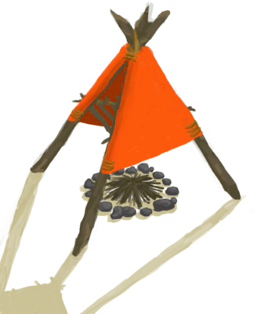

# 特殊  
   |     |     |     
 :----:    |   :----:    |   :----:    |   :----:    
[ [补给胶囊](TV_SupplyCapsule.md)](TV_SupplyCapsule.md)  |  [ [哺乳期山羊](GoatEnclosureLactating.md)](GoatEnclosureLactating.md)  |  [ [雌灰山鹑](PartridgeFemaleEnclosure.md)](PartridgeFemaleEnclosure.md)  |  [ [公山羊](GoatEnclosureMale.md)](GoatEnclosureMale.md)  
[ [公猪](BoarEnclosureMale.md)](BoarEnclosureMale.md)  |  [ [母山羊](GoatEnclosureFemale.md)](GoatEnclosureFemale.md)  |  [ [母猪](BoarEnclosureFemale.md)](BoarEnclosureFemale.md)  |  [ [沙堡](SandCastle.md)](SandCastle.md)  
[ [瓦斯炉(开)](GasCookerOn.md)](GasCookerOn.md)  |  [ [小灰山鹑](PartridgeChick.md)](PartridgeChick.md)  |  [ [小羊](GoatEnclosureKid.md)](GoatEnclosureKid.md)  |  [ [小猪](BoarEnclosurePiglet.md)](BoarEnclosurePiglet.md)  
[ [雄灰山鹑](PartridgeMaleEnclosure.md)](PartridgeMaleEnclosure.md)  |  [ [烟熏炉](Smoker.md)](Smoker.md)  |  [ [烟熏炉(熄灭)](SmokerExtinguished.md)](SmokerExtinguished.md)  |  [ [烟熏炉(塑料布)(熄灭)](SmokerExtinguishedPlastic.md)](SmokerExtinguishedPlastic.md)  
[ [烟熏炉(无火)](SmokerNoFire.md)](SmokerNoFire.md)  |  [ [烟熏炉(塑料布)(无火)](SmokerNoFirePlastic.md)](SmokerNoFirePlastic.md)  |  [ [烟熏炉(塑料布)(点燃)](SmokerPlastic.md)](SmokerPlastic.md)  |  [ [烟熏炉框架](SmokerFrame.md)](SmokerFrame.md)  
[ [粘土火盆](ClayFirePit.md)](ClayFirePit.md)  |    |    |    
