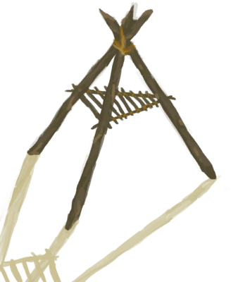

# 特殊  

[

 [补给胶囊](TV_SupplyCapsule.md)](TV_SupplyCapsule.md)

[

 [哺乳期山羊](GoatEnclosureLactating.md)](GoatEnclosureLactating.md)

[

 [雌灰山鹑](PartridgeFemaleEnclosure.md)](PartridgeFemaleEnclosure.md)

[

 [公山羊](GoatEnclosureMale.md)](GoatEnclosureMale.md)

[

 [公猪](BoarEnclosureMale.md)](BoarEnclosureMale.md)

[

 [母山羊](GoatEnclosureFemale.md)](GoatEnclosureFemale.md)

[

 [母猪](BoarEnclosureFemale.md)](BoarEnclosureFemale.md)

[

 [沙堡](SandCastle.md)](SandCastle.md)

[

 [瓦斯炉](GasCookerOn.md)](GasCookerOn.md)

[

 [小灰山鹑](PartridgeChick.md)](PartridgeChick.md)

[

 [小羊](GoatEnclosureKid.md)](GoatEnclosureKid.md)

[

 [小猪](BoarEnclosurePiglet.md)](BoarEnclosurePiglet.md)

[

 [雄灰山鹑](PartridgeMaleEnclosure.md)](PartridgeMaleEnclosure.md)

[

 [烟熏炉](Smoker.md)](Smoker.md)

[

 [烟熏炉](SmokerExtinguished.md)](SmokerExtinguished.md)

[

 [烟熏炉](SmokerExtinguishedPlastic.md)](SmokerExtinguishedPlastic.md)

[

 [烟熏炉](SmokerNoFire.md)](SmokerNoFire.md)

[

 [烟熏炉](SmokerNoFirePlastic.md)](SmokerNoFirePlastic.md)

[

 [烟熏炉](SmokerPlastic.md)](SmokerPlastic.md)

[

 [烟熏炉框架](SmokerFrame.md)](SmokerFrame.md)

[

 [粘土火盆](ClayFirePit.md)](ClayFirePit.md)

  
  

