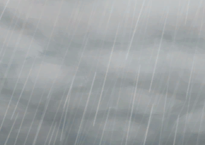

# 天气  

[

 [大雨](TropicalIsland_HeavyRain.md)](TropicalIsland_HeavyRain.md)

[

 [大雨](TropicalIsland_HeavyRainInfinite.md)](TropicalIsland_HeavyRainInfinite.md)

[

 [大雨](TropicalIsland_HeavyRainLong.md)](TropicalIsland_HeavyRainLong.md)

[

 [大雨](TropicalIsland_HeavyRainStart.md)](TropicalIsland_HeavyRainStart.md)

[

 [多云](TropicalIsland_PartiallyCloudy.md)](TropicalIsland_PartiallyCloudy.md)

[

 [风暴](TropicalIsland_Storm.md)](TropicalIsland_Storm.md)

[

 [风暴](TropicalIsland_StormInfinite.md)](TropicalIsland_StormInfinite.md)

[

 [风暴](TropicalIsland_StormStart.md)](TropicalIsland_StormStart.md)

[

 [风向不利](OpenSea_UnFavourable.md)](OpenSea_UnFavourable.md)

[

 [风向非常不利](OpenSea_VeryUnFavourable.md)](OpenSea_VeryUnFavourable.md)

[

 [风向非常有利](OpenSea_VeryFavourable.md)](OpenSea_VeryFavourable.md)

[

 [风向非常有利](OpenSea_VeryFavourableInfinite.md)](OpenSea_VeryFavourableInfinite.md)

[

 [风向有利](OpenSea_Favourable.md)](OpenSea_Favourable.md)

[

 [后有风暴](OpenSea_StormBehind.md)](OpenSea_StormBehind.md)

[

 [后有风暴](OpenSea_StormBehindInfinite.md)](OpenSea_StormBehindInfinite.md)

[

 [平静](OpenSea_Calm.md)](OpenSea_Calm.md)

[

 [平静](OpenSea_CalmInfinite.md)](OpenSea_CalmInfinite.md)

[

 [前有风暴](OpenSea_StormFront.md)](OpenSea_StormFront.md)

[

 [晴朗](TropicalIsland_Clear.md)](TropicalIsland_Clear.md)

[

 [晴朗](TropicalIsland_ClearInfinite.md)](TropicalIsland_ClearInfinite.md)

[

 [晴朗](TropicalIsland_ClearStart.md)](TropicalIsland_ClearStart.md)

[

 [小雨](TropicalIsland_LightRain.md)](TropicalIsland_LightRain.md)

[

 [小雨](TropicalIsland_LightRainStart.md)](TropicalIsland_LightRainStart.md)

[

 [阴天](TropicalIsland_Cloudy.md)](TropicalIsland_Cloudy.md)

[

 [阴天](TropicalIsland_CloudyStart.md)](TropicalIsland_CloudyStart.md)

  
  

