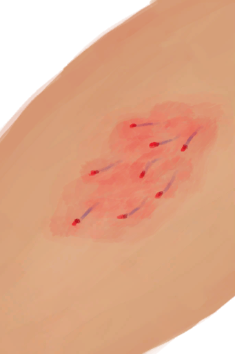
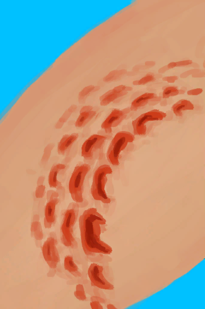

# 伤口  
   |     |     |     
 :----:    |   :----:    |   :----:    |   :----:    
[ [崩解烙印](W_UnravellingMark.md)](W_UnravellingMark.md)  |  [ [擦伤](W_Abrasion.md)](W_Abrasion.md)  |  [ [狗咬伤](W_DogBite.md)](W_DogBite.md)  |  [ [鬼掌印](W_HunterMark.md)](W_HunterMark.md)  
[ [海胆刺伤](W_UrchinWound.md)](W_UrchinWound.md)  |  [ [海胆刺伤](W_UrchinWoundSpines.md)](W_UrchinWoundSpines.md)  |  [ [海怪刺伤](W_SeahoundSting.md)](W_SeahoundSting.md)  |  [ [巨蜥咬伤](W_MonitorBite.md)](W_MonitorBite.md)  
[ [猕猴咬伤](W_MacaqueBite.md)](W_MacaqueBite.md)  |  [ [轻微撕裂伤](W_MinorLaceration.md)](W_MinorLaceration.md)  |  [ [鲨鱼咬伤](W_SharkBite.md)](W_SharkBite.md)  |  [ [眼镜蛇毒液](W_CobraSpit.md)](W_CobraSpit.md)  
[ [已缝合的轻微撕裂伤](W_MinorLacerationStitched.md)](W_MinorLacerationStitched.md)  |  [ [已缝合的右臂撕裂伤](W_ArmLacerationRStitched.md)](W_ArmLacerationRStitched.md)  |  [ [已缝合的右腿撕裂伤](W_LegLacerationRStitched.md)](W_LegLacerationRStitched.md)  |  [ [已缝合的左臂撕裂伤](W_ArmLacerationLStitched.md)](W_ArmLacerationLStitched.md)  
[ [已缝合的左腿撕裂伤](W_LegLacerationLStitched.md)](W_LegLacerationLStitched.md)  |  [ [右臂骨折](W_ArmFractureR.md)](W_ArmFractureR.md)  |  [ [右臂撕裂伤](W_ArmLacerationR.md)](W_ArmLacerationR.md)  |  [ [右脚踝扭伤](W_LegSprainedR.md)](W_LegSprainedR.md)  
[ [右手腕扭伤](W_ArmSprainedR.md)](W_ArmSprainedR.md)  |  [ [右腿骨折](W_LegFractureR.md)](W_LegFractureR.md)  |  [ [右腿撕裂伤](W_LegLacerationR.md)](W_LegLacerationR.md)  |  [ [蜘蛛咬伤](W_SpiderBite.md)](W_SpiderBite.md)  
[ [左臂骨折](W_ArmFractureL.md)](W_ArmFractureL.md)  |  [ [左臂撕裂伤](W_ArmLacerationL.md)](W_ArmLacerationL.md)  |  [ [左脚踝扭伤](W_LegSprainedL.md)](W_LegSprainedL.md)  |  [ [左手腕扭伤](W_ArmSprainedL.md)](W_ArmSprainedL.md)  
[ [左腿骨折](W_LegFractureL.md)](W_LegFractureL.md)  |  [ [左腿撕裂伤](W_LegLacerationL.md)](W_LegLacerationL.md)  |    |    

